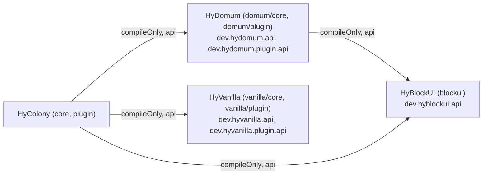
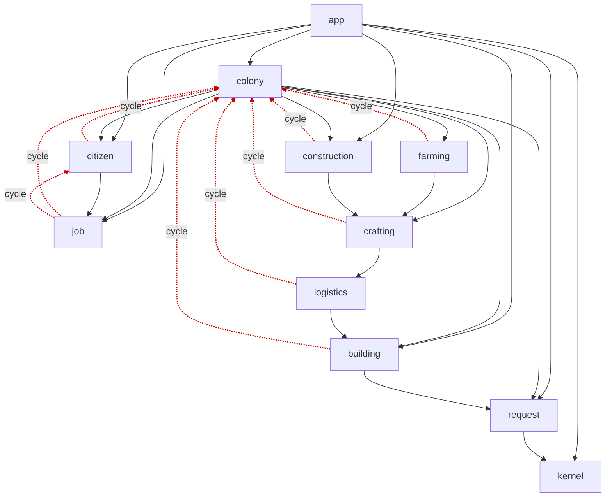
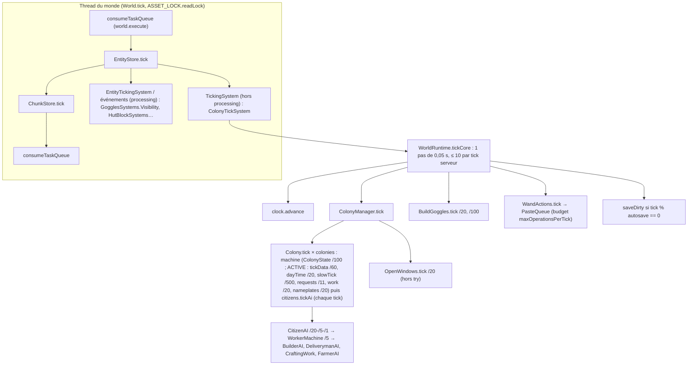

# Audit global HyColony : 01, carte de l'architecture

```
ÉTAT : phase 1 terminée (toutes sections). Commit audité : 3e2e70ca (le code est celui de 2f9a11eb et de
c24bf475 ; les fichiers modifiés entre eux sont des docs). Sections 1, 2, 7 depuis la lecture directe et le
rapport « ports » ; 3 à 6, 8 et 9 depuis les rapports d'exploration (modèle de données, ECS, UI, threads).
Suite : 02-findings-*.md (phase 2), 02-findings-completude.md (phase 3), 03-verification.md (phase 4), AUDIT.md.
```

## 1. Mods et points d'entrée

| Mod       | `Main`                                                                   | `setup()`                                                                                                                                                                                                                                                                                                                                                                                                                                                                           | `shutdown()`                      |
|-----------|--------------------------------------------------------------------------|-------------------------------------------------------------------------------------------------------------------------------------------------------------------------------------------------------------------------------------------------------------------------------------------------------------------------------------------------------------------------------------------------------------------------------------------------------------------------------------|-----------------------------------|
| HyBlockUI | `blockui/src/main/java/dev/hyblockui/HyBlockUIPlugin.java:9`             | rien : bibliothèque, ses fenêtres sont ouvertes par les mods qui l'utilisent (Javadoc :5-8)                                                                                                                                                                                                                                                                                                                                                                                         | absent                            |
| HyVanilla | `vanilla/plugin/src/main/java/dev/hyvanilla/plugin/HyVanillaPlugin.java` | `registerSystem(new FlowerPotSystem(VanillaIds.flowerPots()))`, inconditionnel car HyColony ordonne sa protection avant ce système (`HyVanillaSystems`)                                                                                                                                                                                                                                                                                                                             | absent                            |
| HyDomum   | `domum/plugin/src/main/java/dev/hydomum/plugin/HyDomumPlugin.java`       | constructeur : `ConfigQuarantine.moveAsideIfUnreadable` puis `withConfig` ; `setup` : `config.save()` (log si échec), `DomumIds.load()`, `OrnamentVariantRegistry(BlockTypeSynchronizer, VariantStore(universe/hydomum/variants.json), VariantAssets)`, `registerCutter` (système `CutterSystem` + `PlayerDisconnectEvent` → `groups.forget`), puis, s'il y a des tags, `LoadAssetEvent` (`PRIORITY_LOAD_LATE`) → `ornaments.start(catalogs)` et `registerCommand(OrnamentCommand)` | absent                            |
| HyColony  | `plugin/src/main/java/dev/hycolony/plugin/HyColonyPlugin.java:33`        | voir ci-dessous                                                                                                                                                                                                                                                                                                                                                                                                                                                                     | `packs.unregisterAssets()` (:145) |

`HyColonyPlugin.setup()` (`HyColonyPlugin.java:47-68`), dans l'ordre :
1. `config.save()` avec `exceptionally` journalisé (:49-52) ; `ColonyConfig colonyConfig = config.get().toCore()` (:53).
2. `SubPlugins.load(this, config.get().subPlugins())` (:55) : packs d'assets optionnels, à enregistrer avant `LoadAssetEvent`.
3. `WorldRuntimes worlds = new WorldRuntimes(RuntimeSetup.create(colonyConfig, packs))` (:56) ; `IdMap ids = worlds.setup().ids()` ; `GlowingBlock.useEffect(ids.highlightEffect())` (:58, champ static).
4. `HyColonyComponents.register(getEntityStoreRegistry())` (:60) : `CitizenTag` (codec `HyColonyCitizen`) et `MoveTarget` (sans codec).
5. `NPCPlugin.get().registerCoreComponentType("HyColonyTarget", BuilderSensorHyColonyTarget::new)` (:61) : un registre global du plugin NPC, hors des proxies du plugin.
6. `registerSystems` (:71-86) : `ColonyTickSystem`, `CitizenBodyLifecycleSystem`, `BlockSystems.register` (huttes, protection, champs), `CitizenUseSystem`, `CitizenFireImmunitySystems.Grant/Guard`, `GogglesSystems.ArmorChange/Visibility`, et `PlayerReadyEvent` global → `GogglesSystems.onPlayerReady`.
7. `WandInteraction.register(this, worlds)` (:63) ; `registerCommand(new HyColonyCommand(...))` (:64).
8. `registerWorldEvents` (:89-100) : `StartWorldEvent` global → `onWorldStart` (valide les ids, `HytaleBlueprintSource.prewarm`, `worlds.create(world)`) ; `RemoveWorldEvent` global en `EventPriority.LAST` → `worlds.remove(world)` si non annulé ; `ShutdownEvent` → `worlds.all().forEach(WorldRuntime::saveAll)`.
9. `PlayerDisconnectEvent` → `onDisconnect` (:119-140) : lunettes, baguette, fondation non confirmée, chacun via `world.execute` et `safely`.

Symétrie du nettoyage : `shutdown()` ne défait que les packs d'assets. Les systèmes, événements et commandes passent par `this.getXxxRegistry()` (proxies tracés par Hytale) ; l'enregistrement `NPCPlugin.registerCoreComponentType` (:61) et les deux champs statiques (`GlowingBlock.effect`, `Highlights.ACTIVE`) ne sont pas défaits. Détail en § 4.

**Racine de composition** : `WorldRuntime` (`plugin/.../WorldRuntime.java:61-105`), un par monde, créé par `WorldRuntimes.create` sur `StartWorldEvent` (thread du monde). Il construit tous les adaptateurs `Hytale*`, le `ColonyContext` (`colony/ColonyContext.java:17`) et `GamePorts` (`colony/GamePorts.java:17`), puis `ColonyManager` (`app/ColonyManager.java`) avec `HytaleUiPort`, `HytalePreviewPort`, `BuildGoggles`, `WandActions`, et ouvre le stockage (`FileColonyStorage(world.getSavePath()/hycolony)`, `MigrationChain.sp3b()`, `loadAll()` si les ids sont valides). Le cœur enregistre ses types dans `CoreFeatures` (`core/.../CoreFeatures.java`, « MC ModBuildings, ModJobs ») et les packs optionnels par `FeaturePack` (chargé par réflexion, `SubPlugins.java:185-186`).

**Tick** : `ColonyTickSystem` (`TickingSystem<EntityStore>`, `plugin/.../ColonyTickSystem.java:14`) accumule `dt` par monde et appelle `WorldRuntime.tickCore()` toutes les 0,05 s (`CORE_TICK_SECONDS`), au plus `MAX_CATCH_UP = 10` pas par tick serveur (au-delà, le retard est abandonné, « MineColonies loses ticks too »). `tickCore` (`WorldRuntime.java:130-143`) : `clock.advance()`, `manager.tick()`, `goggles.tick()`, `wand.tick()`, autosave `clock.currentTick() % autosaveTicks == 0` → `saveDirty()` ; le tout dans un `catch (RuntimeException)` journalisé SEVERE.

## 2. Carte des paquets

### 2.1 Dépendances entre mods



Chaque plugin n'embarque que son propre cœur (`bundled`, `hy.hytale-mod.gradle.kts:11-13`) ; les manifests déclarent les dépendances `HyColony:hyblockui`, `hydomum`, `hyvanilla` en `=0.1.0`. `checkModApis` interdit tout import hors `api`.

### 2.2 Paquets du cœur HyColony (`dev.hycolony.core`)

| Paquet                                         | Rôle (vérifié sur les Javadoc de classe)                                                                                                                                                                                                                                                                                                                                                                                                                                                                                               | Fichiers                 |
|------------------------------------------------|----------------------------------------------------------------------------------------------------------------------------------------------------------------------------------------------------------------------------------------------------------------------------------------------------------------------------------------------------------------------------------------------------------------------------------------------------------------------------------------------------------------------------------------|--------------------------|
| racine                                         | `CoreFeatures` (racine de composition des types de bâtiments et métiers, « MC ModBuildings, ModJobs »), `FeaturePack` (types d'un sous-plugin)                                                                                                                                                                                                                                                                                                                                                                                         | 2                        |
| `app`                                          | couche applicative : `ColonyManager` (toutes les colonies d'un monde, point d'entrée du plugin), `ColonyFoundation`, `ColonyPersistence`, `ColonyProtection` (« MC ColonyPermissionEventHandler »), `HutPlacement`, `NeedsPlayerAnnouncer`                                                                                                                                                                                                                                                                                             | 6                        |
| `app/action`                                   | actions des joueurs : `HutActions`, `WorkOrderActions`, `RequestActions`, `LogisticsActions`, `CraftingActions`, `FieldActions`, `CitizenInventoryActions`, `ColonyAdministration`, `ManagedHut`                                                                                                                                                                                                                                                                                                                                       | 9                        |
| `app/ui`                                       | records de vue et le port `UiPort` (`TownHallView`, `BuildingView`, `CitizenView`, `RequestsView`, `WorkOrdersView`, `FieldView`, `WandView`, `FoundColonyView`, `CitizenRow`, `NeedsPlayerNotice`, `WindowKey`)                                                                                                                                                                                                                                                                                                                       | 12                       |
| `app/view`                                     | constructeurs de vues (`*Views`, `ColonyWindows`, `OpenWindows`, `TownHallStats`, `SkillRows`, `JobSkillShares`, `WorkOrderStatus`)                                                                                                                                                                                                                                                                                                                                                                                                    | 11                       |
| `app/wand`, `app/goggles`                      | baguette de construction (Structurize) et lunettes                                                                                                                                                                                                                                                                                                                                                                                                                                                                                     | 8, 2                     |
| `app/persistence`                              | `ColonySerializer`, `BuildingSerializer`, `CitizenSerializer`, `CraftingHeal`                                                                                                                                                                                                                                                                                                                                                                                                                                                          | 4                        |
| `colony`                                       | l'agrégat `Colony`, `ColonyContext` (record de 13 composants), `GamePorts` (8 ports), `ColonyState` (activité), `ColonyEvents`, `EventLog`, `ColonyRefusal`, `ColonyRegistries`, `ColonySettings`, `ColonyBuildingListener`, `CitizenNameplates` ; `permission/` (rangs, actions, `BlockUse`), `territory/` (revendications)                                                                                                                                                                                                           | 11, 6, 2                 |
| `building`, `building/module`                  | `Building`, `BuildingManager`, `BuildingRegistry`, `BuildingType`, `BuildingResolver`, `ModuleProducer` ; modules de capacité                                                                                                                                                                                                                                                                                                                                                                                                          | 8, 8                     |
| `citizen`                                      | `CitizenData`, `CitizenManager`, `CitizenAI` (« MC CitizenAI.calculateNextState »), `CitizenState`, `Skills`, `SkillData`, `Experience`, `CitizenNames`, `CitizenSpawned`, `Gender`                                                                                                                                                                                                                                                                                                                                                    | 11                       |
| `job`, `job/work`                              | `Job` (seule classe abstraite du cœur), `JobAI`, `JobType`, `JobRegistry`, `JobXp`, `WorkerModule` (« MC WorkerBuildingModule »), `HiringMode`, `HiringListener`, `IdleAI`, `TaskQueues` ; socle des travailleurs : `WorkerMachine`, `WorkDelay`, `WorkerHands`, `WorkerStock`, `SyncRequests`, `ToolRequests`                                                                                                                                                                                                                         | 10, 6                    |
| `request`, `request/model`, `request/resolver` | `RequestManager` (façade), `RequestAssigner`, `RequestTransitions`, `RequestCanceller`, `RequestStore`, `ResolverRegistry`, `RequestSerializer`, `RequestableJson`, `SavedRequests` ; `Requestable` scellé (`Stack`, `StackList`, `Tool`, `Delivery`, `Pickup`…), `RequestToken`, `RequesterId`, `Resolver` ; `PlayerResolver`, `RetryingResolver`                                                                                                                                                                                     | 15, 11, 2                |
| `construction/*`                               | `blueprint` (`Blueprint`, `StructurePlan`, `BlueprintSource`), `builder` (`BuilderAI`, `BuilderBlockWork`, `BuilderGathering`, `BuilderWalker`, `StructureScan`, `WorkSpot`…), `hut`, `resources`, `shared` (`BuilderSettingsModule`), `workorder` (`WorkManager`, `WorkOrder`, `WorkOrderValidation`)                                                                                                                                                                                                                                 | 5, 15, 4, 6, 5, 10       |
| `logistics/*`                                  | `warehouse` (`WarehouseBuilding`, `WarehouseStorage`, `WarehouseStockResolver`, `CourierResolver`, `HutKeep`…), `courier` (`DeliverymanJob`, `DeliverymanAI`, `CourierTaskPicker`, `DeliveryPreparation`, `DeliveryDrop`, `ForcedInsert`…), `pickup`                                                                                                                                                                                                                                                                                   | 13, 13, 5                |
| `crafting/*`                                   | `recipe` (`RecipeRegistry`, `RecipeCatalog` port, `CraftingRulesJson`, `CraftingSetup`), `module` (`CraftingModule`, `RecipeImprovement`), `job` (`CraftingWork`, `CrafterHands`, `CraftedOutputs`), `request` (`CraftingRequestResolver`, `CraftingProductionResolver`, `CraftingCycles`), `task` (`CraftingTasks`, `Crafters`)                                                                                                                                                                                                       | 12, 12, 10, 8, 3         |
| `farming/*`                                    | `FarmingAccess` port ; `field` (`FarmField`, `FieldRegistry`, `FieldRadii`, `FieldStage`, `FieldJson`), `hut` (`FarmerFieldsModule`, `FieldWalk`), `job` (`FarmerAI`, `FarmWork`, `FieldPass`)                                                                                                                                                                                                                                                                                                                                         | 2, 6, 7, 7               |
| `kernel/*`                                     | `BlockPos`, `Vec3`, `Either`, `WorldKey` ; `ai` (`TickRateStateMachine`, « port de MC BasicStateMachine + TickRateStateMachine »), `config` (`ColonyConfig`), `event` (`EventBus`), `item` (`Inventory`, `ItemKey`, `ItemAmount`, `ToolType`, `ToolScale`…), `nav` (`BodyWalker`, `StuckHandler`, `SafeRoute`, `DetouringBodies`, `RouteSearch`, `DangerousCells`, `ClearTarget`), `persist` (`MigrationChain`, `FileColonyStorage`, `ColonyStorage`, `SavedJson`…), `port` (11 ports + `BodyId`, `BodyAnimation`, `Msg`, `NavStatus`) | 5, 9, 4, 1, 11, 7, 6, 15 |

Direction des dépendances entre paquets de premier niveau : figée par `FeatureDependenciesTest` (`core/src/test/.../FeatureDependenciesTest.java:20-73`). `root` et `app` ne sont accessibles par personne ; `kernel` n'accède à rien ; `request` → `kernel` seulement ; `building` → colony, kernel, request ; `citizen` → building, colony, job, kernel ; `job` → building, citizen, colony, kernel, logistics, request ; `logistics` → building, citizen, colony, job, kernel, request ; `crafting` → + logistics ; `farming` → + crafting ; `construction` → building, citizen, colony, crafting, job, kernel, logistics, request ; `colony` → building, citizen, construction, crafting, farming, job, kernel, request.

Arêtes réelles mesurées (imports, fichiers → paquet cible, phase 0) : **chaque arête autorisée est utilisée** (aucune ligne de la matrice n'est morte). Les plus lourdes : `app → kernel` 34, `construction → kernel` 33, `colony ← app` 27, `crafting → kernel` 27, `logistics → building` 24, `construction → building` 21, `crafting → building` 20, `logistics → colony/request` 19. Les arêtes « montantes » qui forment le cycle par `colony` : `building → colony` 5, `citizen → colony` 3, `job → colony` 9, `logistics → colony` 19, `crafting → colony` 17, `construction → colony` 15, `farming → colony` 5.



Cycles dans les sous-paquets (heuristique à 2 nœuds, phase 0 cmd 13) : `app↔app.action`, `app↔app.view`, `building↔building.module`, `farming.job↔farming.hut`, `request↔request.resolver`. `ArchitectureTest` n'impose `beFreeOfCycles()` qu'à `construction` et `crafting`.

### 2.3 Paquets du plugin HyColony (`dev.hycolony.plugin`)

racine (`HyColonyPlugin`, `WorldRuntime`, `WorldRuntimes`, `RuntimeSetup`, `ColonyTickSystem`, `IdMap`) ; `adapter` (15 : les `Hytale*` + `LiveWindows`, `HutPickUp`) ; `block` (11 : systèmes de huttes, de champs, de protection, `HytaleBlockBreaker`, `HytaleBlockStates`, `BenchTiers`) ; `command` (8 : `HyColonyCommand`, `*SelfTest`) ; `config` (8 : `HyColonyConfig` et une section par section MC) ; `crafting` (7 : `HytaleRecipeCatalog`, `BenchIndex`, `RecipeConversion`…) ; `farming` (3) ; `goggles` (1) ; `item` (1) ; `npc` (10 : composants, `GuardedBodies`, `CitizenSpeed`, systèmes de corps) ; `prefab` (6 : `HytaleBlueprintSource`, `PrefabStyles`, `PrefabReading`, `PrefabCells`, `FillBlocks`) ; `subplugin` (4) ; `ui` (10 + `citizen` 9, `hut` 11, `townhall` 5, `highlight` 5, `wand` 2, `field` 1, `logistics` 1). Cycles à 2 nœuds entre `plugin` (racine) et 8 sous-paquets : la racine de composition importe tout et `WorldRuntime`/`WorldRuntimes` sont importés en retour (voir § 5 pour les conséquences).

### 2.4 Mods frères

- **HyDomum** : `dev.hydomum.api` (`OrnamentShape`, `ShapeCatalog`, `VariantKey`, `MaterialTags`), `dev.hydomum.core` (`DomumConfig`, `SavedVariants` versionné `schemaVersion:1`, `VariantRequests`), `core/cutter` (règles de la table : `CutterActions`, `CutterCatalog`, `CutterCraft`, `CutterOrder`, `CutterView`, `SlotContent`) ; plugin : `cutter` (11 : page, file de fabrication, aperçus, mémoire des groupes), `registry` (`OrnamentVariantRegistry`, `VariantBuilder`), `runtime` (`BlockTypeSynchronizer`, `DynamicBlockTypeFactory`, `VariantAssets`, `VariantBlockType`, `MaterialCatalog`, `IconMap`, `Textures`), `persistence` (`VariantStore`), `debug` (`OrnamentCommand`, `VariantGift`), `plugin/api` (`HyDomumSystems`, `OrnamentVariant`).
- **HyVanilla** : `dev.hyvanilla.core` (`FlowerPot`, la règle « comme Minecraft FlowerPotBlock » ; `FlowerPotBlocks`) ; plugin : `FlowerPotSystem`, `FlowerPotUse`, `VanillaIds`, `plugin/api/HyVanillaSystems`.
- **HyBlockUI** : `dev.hyblockui.api` (14) : `ConfigQuarantine`, `HeldWindows`, `InventoryDrop`, `InventoryGrids`, `InventoryMoves`, `InventoryWatch`, `PageEvents`, `PageRedraw`, `PlayerItems`, `PlayerPanels`, `PlayerSection`, `ReturningContainerWindow`, `Texts`, `UiSounds`.

### 2.5 Ports → adaptateurs → simulations

16 ports (11 dans `kernel/port`, plus `UiPort`, `BlueprintSource`, `ColonyStorage`, `RecipeCatalog`, `FarmingAccess`). Un adaptateur chacun, tous câblés dans `WorldRuntime` (`WR:`) ; une simulation `Fake*` chacun sauf `ColonyStorage` (les tests utilisent `FileColonyStorage` sur un dossier temporaire, plus `FailingStorage`/`FlakyStorage` privés).

| Port (`core/.../`)                              | Méthodes                           | Adaptateur (`plugin/.../`, lignes)                                                              | Décorateurs et aides                                                                                                                        | Fake (`core/src/test/.../testing/`)       |
|-------------------------------------------------|------------------------------------|-------------------------------------------------------------------------------------------------|---------------------------------------------------------------------------------------------------------------------------------------------|-------------------------------------------|
| `kernel/port/CitizenBodies.java:10`             | 12                                 | `adapter/HytaleCitizenBodies.java:48` (354)                                                     | `DetouringBodies(GuardedBodies(…))` : `npc/GuardedBodies.java:23` (116, attrape et replie), `core/kernel/nav/DetouringBodies.java:23` (198) | `FakeBodies` (149)                        |
| `kernel/port/ContainerAccess.java:11`           | 6 (+2 défaut)                      | `adapter/HytaleContainerAccess.java:28` (198)                                                   | `item/HytaleStacks`                                                                                                                         | `FakeContainers` (144)                    |
| `kernel/port/GameClock.java:4`                  | 2                                  | `adapter/HytaleGameClock.java:8` (37)                                                           | —                                                                                                                                           | `FakeClock` (18)                          |
| `kernel/port/ItemCatalog.java:11`               | 10 (+1)                            | `adapter/HytaleItemCatalog.java:50` (342)                                                       | possède `HytaleStacks`                                                                                                                      | `FakeCatalog` (79)                        |
| `kernel/port/Notifier.java:5`                   | 1                                  | `adapter/HytaleNotifier.java:11` (24)                                                           | —                                                                                                                                           | `FakeNotifier` (18)                       |
| `kernel/port/PlayerDirectory.java:9`            | 6 (+1)                             | `adapter/HytalePlayerDirectory.java:25` (126)                                                   | —                                                                                                                                           | `FakePlayers` (58)                        |
| `kernel/port/PlayerInventory.java:11`           | 4 (+2)                             | `adapter/HytalePlayerInventory.java:31` (111)                                                   | —                                                                                                                                           | `FakePlayerInventory` (74)                |
| `kernel/port/PreviewPort.java:9`                | 3                                  | `adapter/HytalePreviewPort.java:44` (156)                                                       | diffère tout à `world.execute`                                                                                                              | `FakePreviews` (42)                       |
| `kernel/port/WorldBlocks.java:9`                | 8                                  | `adapter/HytaleWorldBlocks.java:37` (229)                                                       | `block/HytaleBlockBreaker` (139), `adapter/HytaleBlocks` (97), `block/HytaleBlockStates` (108), `block/BenchTiers` (58)                     | `FakeWorldBlocks` (101)                   |
| `kernel/port/WorldEffects.java:6`               | 4                                  | `adapter/HytaleWorldEffects.java:32` (200)                                                      | —                                                                                                                                           | `FakeWorldEffects` (35)                   |
| `kernel/port/WorldQuery.java:7`                 | 3                                  | `adapter/HytaleWorldQuery.java:22` (103)                                                        | —                                                                                                                                           | `FakeWorld` (29)                          |
| `app/ui/UiPort.java:6`                          | 14                                 | `adapter/HytaleUiPort.java:49` (246)                                                            | `adapter/LiveWindows` (87), `adapter/HutPickUp` (93), `ui/citizen/CitizenInventoryWindows` (142)                                            | `FakeUi` (142)                            |
| `construction/blueprint/BlueprintSource.java:8` | 2 (+2)                             | `prefab/HytaleBlueprintSource.java:61` (209)                                                    | `FillBlocks`, `PrefabReading`, `PrefabCells`, `PrefabStyles`                                                                                | `FakeBlueprints` (114)                    |
| `kernel/persist/ColonyStorage.java:8`           | 6 (lève `IOException` par contrat) | `core/kernel/persist/FileColonyStorage.java:22` (172, dans le cœur ; le plugin donne le chemin) | —                                                                                                                                           | aucun                                     |
| `crafting/recipe/RecipeCatalog.java:13`         | 6 (+`NONE`)                        | `crafting/HytaleRecipeCatalog.java:22` (116)                                                    | `BenchIndex`, `ResourceTypeIndex`, `KnownRecipes`, `RecipeConversion`                                                                       | `testing/crafting/FakeRecipeCatalog` (89) |
| `farming/FarmingAccess.java:13`                 | 12 (+`NONE`)                       | `farming/HytaleFarming.java:26` (163)                                                           | `FarmBlocks`, `FarmingIds` ; bâti sur `WorldBlocks`                                                                                         | `testing/farming/FakeFarming` (118)       |

Trois ports ne passent pas par `ColonyContext`/`GamePorts` : `UiPort` (constructeur de `ColonyManager`), `PreviewPort` (`BuildGoggles`, `WandActions`) et `ColonyStorage` (`persistence().setStorage`).

Contrat « un port ne lève jamais » (§ 4) : documenté au niveau de la classe pour `PreviewPort`, `WorldEffects`, `RecipeCatalog`, `FarmingAccess` ; par méthode pour `WorldQuery` ; partiel ou absent pour les autres (`GameClock`, `Notifier`, `PlayerInventory`, `ContainerAccess.count/contents`, `CitizenBodies.isAlive/position/navStatus`, `WorldBlocks.isLoaded/place`, `ItemCatalog`). Côté adaptateurs, les méthodes publiques de port **sans** `try/catch` : `HytaleGameClock.isDaytime:33-36`, `HytaleNotifier.send:18-23`, `HytaleWorldQuery.isLoaded:37-39`, `HytalePlayerDirectory.isOnline:39-41, position:45-53, onlineIn:123-125`, `HytaleContainerAccess.insert:80` (le test `Item.getAssetMap()` est hors du try), `HytalePreviewPort.show:62-70, hide:73-75, hideAll:78-84, remove:119-136`, `HytaleUiPort.notifyNeedsPlayer:185-190, openCitizenInventory:180-182` et la partie hors `guarded` de `open:205-223`, `HytaleBlueprintSource.defaultFillBlock:85-87` (`IdMap.blockId` lève si la clé manque), `fillBlockChoices:90-92`, `styles:133-135`, `load:141`, `HytaleRecipeCatalog.all/byHytaleId/itemsOf/benchCategories` et `HytaleFarming.seeds/fertilizerItem` (lectures de maps en mémoire), et les 11 méthodes de `HytaleCitizenBodies` (couvertes par `GuardedBodies`, sauf l'accès direct `WorldRuntime.bodies()` depuis `BodySelfTest`). Entièrement gardés : `HytaleItemCatalog`, `HytaleWorldBlocks`, `HytaleWorldEffects`, `HytalePlayerInventory`, `GuardedBodies`. Ces points sont repris en phase 2, axe E.

Règles de jeu dans le plugin (§ 1) repérées : `HytaleCitizenBodies.java:52` `TELEPORT_Y_RANGE = 10` (« MC completeStuckAction searches 10 blocks », utilisé :333-334) ; `HytaleGameClock.java:10,13` `SUNRISE_SCALED_TIME = 0.25`, `SUNSET_SCALED_TIME = 0.75` (définit « jour », donc quand on travaille : sémantique du port, limite) ; `CitizenFireImmunitySystems.java:45` immunité au feu de tout citoyen (écart documenté) ; `PrefabReading.java:26` `FLOOR_Y = -1` (format des prefabs) ; `HytaleFarming.java:111` `endsWith("_Eternal")` (règle de récolte Hytale) ; `HytaleItemCatalog.java:53,58,233,281` replis de dureté 1f / pile 1 / vitesse 1f qui recopient `ToolScale.hardness` du cœur. Les protections de blocs (`block/ProtectionSystems`, `BlockUseProtectionSystem`, `ExplosionProtectionSystem`) délèguent à `manager.protection()` sans règle.

## 3. Modèle de données de la colonie

Chemins relatifs à `core/src/main/java/dev/hycolony/core/`. Tout l'état vit dans des objets Java du cœur, aucun composant ECS ne porte d'état de colonie.

| Collection | Propriétaire (`fichier:ligne`) | Type et clé | Référencé par |
|---|---|---|---|
| Colonies | `ColonyManager` `app/ColonyManager.java:35` (`nextId` :36) | `LinkedHashMap<Integer, Colony>` | id entier : `TerritoryIndex`, `WindowKey`, `ColonyDeleted(int)` |
| Territoire | `TerritoryIndex` `colony/territory/TerritoryIndex.java:10`, partagé par le manager (:34) et chaque `Colony` (`Colony.java:36`) | `HashMap<ClaimCell, Integer>` (cellule 16×16 → id) | **non persisté**, reconstruit au chargement (`ColonyManager.java:185-188`, `ColonyPersistence.claimBuildings` :110-122) |
| Permissions | `Colony.permissions` (:40), `colony/permission/Permissions.java:41-46` | owner UUID, `Map<Integer,Rank>`, `Map<UUID,Member>` | UUID joueur, id de rang |
| Bâtiments | `BuildingManager` `building/BuildingManager.java:27-29` (`Colony.buildings` :41) | `LinkedHashMap<BlockPos,Building>` + index `RequesterId` + `List<JsonObject> unknown` (bruts) | `BlockPos` (`workBuilding`, `homeBuilding`, `WorkOrder.claimedBy`, `FarmField.owner`) ; `RequesterId("building:x,y,z")` dérivé de la position (`Building.java:53`) |
| Modules | `Building.modules` (:42) | `LinkedHashMap<String, BuildingModule>` par `ModuleProducer.key` ; `unknownModules` bruts (:43) | `Building.module(Class)` rend le **premier** (:66-71) ; clés non vérifiées uniques (:61, `put` écrase) |
| Citoyens | `CitizenManager` `citizen/CitizenManager.java:25` | `TreeMap<Integer,CitizenData>` ; **aucune méthode de retrait** | id entier (`WorkerModule.workers` `List<Integer>`, `CourierAssignmentModule.couriers`, `Request.citizenId`) |
| Corps et IA | `CitizenManager.java:26-27` | `HashMap<Integer,BodyId>`, `HashMap<Integer,CitizenAI>` | id citoyen ; `BodyId` externe, vérifié par `isAlive` |
| Métiers | `CitizenData.job` (:27), `unknownJob` brut (:28) | un `Job` par citoyen ; `Job.citizen` est un **pointeur** (`Job.java:17`) | la hutte est retrouvée par `citizen.workBuilding()` (`Job.java:38-40`) |
| Ordres de travail | `WorkManager` `construction/workorder/WorkManager.java:38-40` (`Colony.work` :44) | `LinkedHashMap<Integer,WorkOrder>` (id jamais réutilisé) + `HashMap<BlockPos,WorkOrder>` | id ; hutte du bâtisseur et cible par `BlockPos` |
| Requêtes | `RequestManager` (`Colony.java:62`), `RequestStore` `request/RequestStore.java:24-27` | `LinkedHashMap<RequestToken,Request>`, résolveur par token, tokens par résolveur et par demandeur | `RequestToken(UUID)` ; parent et enfants par token (`Request.java:33-34`) |
| Résolveurs | `ResolverRegistry` `request/ResolverRegistry.java:22-30` | listes + maps par id | intégrés `PlayerResolver`, `RetryingResolver` (`Colony.java:64-65`) ; ceux des bâtiments par `Building.attachResolvers` (:153-158) |
| Recettes, champs | `ColonyRegistries` (`colony/ColonyRegistries.java:11-12`) → `RecipeRegistry`, `FieldRegistry` | `LinkedHashMap<RecipeId,Recipe>`, `LinkedHashMap<BlockPos,FarmField>` | `RecipeId` ; `BlockPos` |
| Files des métiers | `DeliverymanJob.queue/ongoing` (:36-37), `FarmerJob.tasks` (`CraftingTasks`), `WarehouseRequestQueue.tokens` (module, :16) | listes de `RequestToken` | élaguées paresseusement (`TaskQueues.head`, `CourierTaskPicker.pull`) ; la file d'entrepôt **n'est pas réparée au chargement** |
| Fenêtres ouvertes | `OpenWindows.open` `app/view/OpenWindows.java:24` | `HashMap<UUID, Watch>` par joueur (une seule fenêtre suivie par joueur) | `WindowKey`, re-résolu par id de colonie, `BlockPos` de hutte ou id de citoyen |
| Baguette, collage, lunettes, fondation | `WandSessions` (:12), `PasteQueue.queue` (:33), `BuildGoggles.wearers` (:35), `ColonyFoundation.pending` (:35) | maps par UUID joueur, en mémoire seulement | ids ; `PasteQueue` n'est pas purgé par `deleteColony` |

Pointeurs directs tenus d'un tick à l'autre : `Job.citizen`, `CitizenAI.data/jobAI`, les records de contexte des métiers (`BuilderContext`, `WorkerStock`, `SyncRequests`, `ToolRequests`) : sûrs aujourd'hui parce que **rien ne retire un citoyen** ; `BuildSite.order/target` (`construction/builder/BuildSite.java:27,32`) gardés par l'événement bloquant `orderLost` (`BuilderAI.java:46,116-119`), sauf `BuilderBlockWork.java:211,252` qui lisent `ctx.site().target()` sans revérifier ; `BuildingResourcesModule.order` (:29) lit un ordre libéré jusqu'au `BuildSite.clear` ; les résolveurs tiennent leur `Building`/`Colony` (même durée de vie, retirés par `onProviderRemoved`) ; `CitizenData.homeBuilding` jamais validé ; `FieldChoice.checked` (:25) jamais élagué et sauvegardé.

**Chaîne du tick** (`WorldRuntime.tickCore` :129) : `clock.advance()` (:134) → `ColonyManager.tick()` (:134-139) : pour chaque colonie `Colony.tick()` (:86-96 : `machine.tick()` puis `citizens.tickAi()` **à chaque tick quel que soit l'état**, `catch RuntimeException` → `onException` suspend la colonie 6 000 ticks, « MC 5 minutes ») puis `windows.tick()` (:138, hors du try) → `goggles.tick()` (:136) → `wand.tick()`/`PasteQueue.tick` (:137) → autosave (:138-139). Machine de la colonie (`Colony.java:73-84`) : `ColonyState.of` toutes les 100 ticks pour tout état (`ColonyState.java:16-32`) ; seulement en ACTIVE : `citizens::tickData` /60, `checkDayTime` /20, `slowTick` /500 (`BuildingManager.onColonyTick` → `TickingModule`s, `CitizenManager.onColonyTick`, `FieldRegistry.cleanUp`), `requests::tick` /11 (MC `UPDATE_RS_INTERVAL`), `work::tick` /20, `nameplates::refresh` /20. `CitizenAI` : IDLE /20, WANDERING /5, WORKING /1 avec décision toutes les 10 ticks (MC `decideAiTask`) ; `WorkerMachine` cadence 5 (MC `ENTITY_AI_TICKRATE`), délai 100 après exception ; chaque `TickingTransition` démarre à `variant % rate` (`OFFSET_VARIANT` 0..49). Bornes : `BuilderAI.SCAN_LIMIT = 10_000`, `RouteSearch.SEARCH_LIMIT = 4096`, `PasteQueue` budget `maxOperationsPerTick` (sa boucle `clearNext` :80-86 n'est pas débitée). Balayages non bornés (par 500 ticks sauf mention) : auto-embauche huttes × citoyens, rattachement livreurs × bâtiments, champs² par hutte de fermier, `WorkManager.tick` ordres × bâtiments (/20), `BuildingManager.townHall()` (stream, par décision IDLE), `owningContainer` bâtiments × conteneurs, `GogglesView.remaining` plan complet par chantier /100 par porteur.

**Persistance** : schéma **5**, écrit dans `ColonySerializer.SCHEMA_VERSION` (:36) **et** `MigrationChain.sp3b()` (:34-41, deux constantes à garder en phase, test `MigrationV3ToV4Test.java:60-62`). Migrations 1→2 (:44-64), 2→3 (`toolUses` → usure, :67-83), 3→4 (`workstations`, `recipes`, :85-94), 4→5 (`fields`, :96-99). Fixtures v1, v2 (×3), v3 (×3), v4 ; **aucune fixture v5** (aller-retour généré seulement). Ordre de lecture `ColonySerializer.read` (:80-112) puis `heal` (:194-222 : citoyen périmé, `WorkerModule.retainWorkers`, `cancelOrphans`, champs, `CraftingHeal`) et `markDirty` si réparé (:107-110). Contenu inconnu : bâtiment inconnu **gardé brut** (:141-145), module inconnu **gardé brut** (`BuildingSerializer.java:88-89`), métier inconnu **gardé brut** avec sa hutte gardée (`CitizenSerializer.java:91-101`), requête inconnue **abandonnée avec sa famille** (`RequestableJson.java:88-110`) et donc **perdue à la sauvegarde suivante** malgré le commentaire `SavedRequests.java:30`, ordre inconnu abandonné, recette inconnue abandonnée, `FieldStage`/`BuilderSettingsModule.mode`/`HiringMode` (courrier) avec repli ; **lèvent et verrouillent la colonie** : `WorkerModule.read` (:164-172, `HiringMode` inconnu ou `workers` mal formé), `PermissionsSerializer.read` (:42-67, clé absente), doublon de position de bâtiment (`ResolverRegistry.java:52-54`). Écriture `FileColonyStorage.save` (:139-150) : `.tmp` sans fsync, `move(main → .bak)`, `ATOMIC_MOVE(.tmp → main)` ; une seule génération `.bak` ; lecture `main` puis `.bak`, quarantaine `corrupt/` (:119-136) ; `backupVersion` écrit `colony-N.v<version>.json` une fois avant migration (:154-160) ; `archive` à la suppression ; ids jamais réutilisés (`highestIdEverUsed` :67-84). `saveDirty` à l'autosave (`% autosaveTicks`), `saveAll` sur `ShutdownEvent` et `RemoveWorldEvent`, `save` immédiat à la fondation. `Colony.markDirty` a ~67 sites ; `CitizenManager.tickData` (:80-82) marque sale toutes les 60 ticks dès qu'un corps est lié ; `request` et `kernel` ne marquent jamais. `lockedIds` (`ColonyPersistence.java:29`) : schéma trop récent, `IOException`, `RuntimeException` → colonie non enregistrée, jamais réécrite, ses corps laissés en paix (`ColonyManager.java:144-146`) ; **son territoire n'est pas revendiqué**, une autre colonie peut s'y fonder.

**Modules** : `BuildingType(id, hutBlockKey, maxLevel, List<ModuleProducer>)` ; capacités `PersistentModule`, `TickingModule`, `BuildingEventsModule`, `CreatesResolvers`, `ProvidesTab` (+ `job.HiringListener`, `logistics.pickup.KeepsItems` hors de `building` à cause d'`ArchitectureTest`) ; `ModuleTab` est une interface **ouverte** (8 records aujourd'hui). Types : TOWN_HALL (aucun module), BUILDER (worker, resources, builderSettings, workOrderList, keepTools), RESIDENCE (living), WAREHOUSE (couriers, requestQueue, storage, resolvers), DELIVERYMAN (worker, courierTaskView), FARMER (crafting, worker, craftingResolvers, fields, settings, keepTools). Vues : `BuildingViews.tabs` (:84-89) parcourt les modules `ProvidesTab` dans l'ordre ; le plugin (`ui/hut/HutTabs`) fait un `switch` sur le type de record, `default` journalise en FINE. `CoreFeatures.register` (:23-32) enregistre 6 types et 3 métiers ; `FeaturePack` ne peut étendre ni migrations, ni `Requestable`, ni rendus d'onglets.

**Config** (`kernel/config/ColonyConfig.java`) : `Gameplay` (initialCitizenAmount 4 [1..10], **maxCitizenPerColony 250 [25..500] lu par personne**, workersAlwaysWorkInRain), `Claims` (20 [1..250], 8 [1..200], 4 [1..15], 30000 [1000..MAX], 0 [0..1000]), `Permissions` (protection, explosions, bypass 2 [0..4]), `Commands` (3 booléens), `Client.buildGoggleRange` 50 (« Deviation from MC : réglage serveur »), `HyColony` (autosave 5 min [1..60], builderInfiniteResources, creativeOperatorFreeBuilds, SubPlugins), `Structurize.maxOperationsPerTick` 1000. Bornes appliquées dans les constructeurs compacts : une valeur hors bornes ne fait jamais échouer le chargement. Bornes MC (`ServerConfiguration.java` de `version/main`, vérifiées) : identiques pour `initialCitizenAmount` 1..10, `maxCitizenPerColony` 25..CITIZEN_LIMIT_MAX, `maxColonySize` 1..250, `minColonyDistance` 1..200, `initialColonySize` 1..15, `maxDistanceFromWorldSpawn` 1000..MAX, `minDistanceFromWorldSpawn` 0..1000, `permissionEventMinBypassPermLevel` 0..4. La section MC `requestSystem` ne contient plus que `creativeResolve` (absent ici) ; `RetryingResolver.DELAY_TICKS = 1200, MAX_TRIES = 3` sont des constantes chez MC aussi (`StandardRetryingRequestResolver`), donc conformes au § 3.

## 4. Inventaire ECS des plugins

Faits vérifiés dans `build/vineflower/hytale-server` : `Store.invoke` tient le verrou `processing` autour de chaque `EntityEventSystem`/`WorldEventSystem` (`Store.java:1797,1845,1882`), `addEntity`/`removeEntity` le prennent (:446, :723), `EntityTickingSystem`/`ArchetypeTickingSystem` passent par `store.tick(this…)` qui le tient (:2025), alors que `Store.tickInternal` (:1990-2013) **ne verrouille pas** un `TickingSystem` plain (`assertWriteProcessing` :2299-2303 ne lève que si `processing.isHeld()`). C'est pourquoi le cœur, qui tourne dans `ColonyTickSystem`, peut faire `store.addEntity` directement, et pourquoi tout ce qui vient d'un système d'événement, d'un `RefSystem` ou d'une interaction est différé par `world.execute`. `PluginBase.cleanup` (`PluginBase.java:449-480`) défait après `shutdown()` tout ce qui est passé par les registres proxies.

**Composants** (2, HyColony) : `CitizenTag` (`plugin/.../npc/CitizenTag.java:10`, `colonyId`, `citizenId`, `clone` :37, codec `HyColonyCitizen` :11-16, aucune logique) et `MoveTarget` (`npc/MoveTarget.java:8`, `Vector3d target`, `active`, `sinceTick`, sans codec donc transitoire). Enregistrés par `HyColonyComponents.register` (:19-20) depuis `setup()` ; `ComponentType` en champs statiques nullable (:11-12), jamais remis à null.

**Systèmes** (19, tous enregistrés dans `setup()`, aucun `isParallel`, aucun `RefChangeSystem`/`DelayedSystem`, aucun système sur `ChunkStore`) :

| Système | Base | Query | Groupe / dépendances | Écrit | try/catch, annule |
|---|---|---|---|---|---|
| `ColonyTickSystem` (:14) | `TickingSystem` | — | — | tout le cœur, via `tickCore` | `WorldRuntime.java:133-143` (`RuntimeException` seulement) |
| `CitizenBodyLifecycleSystem` (`npc/…:23`) | `RefSystem` | `citizenTag()` | — | `track/untrack` des corps, `onBodyLoaded/Unloaded` du cœur ; `AddReason.LOAD` seulement (:43) | oui, log |
| `CitizenFireImmunitySystems.Grant` (:44) | `RefSystem` | `citizenTag()` | — | `addEffect` par `CommandBuffer` (:67-70) | oui, log |
| `CitizenFireImmunitySystems.Guard` (:106) | `DamageEventSystem` | `citizenTag()` | groupe `DamageModule.getFilterDamageGroup()` (:127-131) | annule le contact avec la braise (:142) | oui, mais **laisse passer** en cas d'échec (:144-146) |
| `GogglesSystems.ArmorChange` (:78) | `EntityEventSystem<InventoryChangeEvent>` | `PlayerRef` | — | `goggles().equip/unequip` | oui, log |
| `GogglesSystems.Visibility` (:119) | `EntityTickingSystem` | `EntityViewer + PlayerRef` | groupe `FIND_VISIBLE_ENTITIES_GROUP`, `AFTER CollectVisible` (:121-137) | `viewer.hiddenCount`, `viewer.visible` en place (:159) | **aucun** (une exception tue le thread du monde, `TickingThread.java:88-97`) |
| `HutBlockSystems.Place/Break/Use` (:64/:120/:162) | `EntityEventSystem` | `PlayerRef` | **aucune dépendance** | `huts().checkPlacement/place/breakBy`, `windows().open*` ; `Use` annule toujours (:189) | oui, annule |
| `ProtectionSystems.Place/Break` (:40/:83) | `EntityEventSystem` | `PlayerRef` | — | `protection().refuses`, annule | oui, annule |
| `BlockUseProtectionSystem` (:35) | `EntityEventSystem<UseBlockEvent.Pre>` | `PlayerRef` | `BEFORE` `HyDomumSystems.cutterUse()` et `HyVanillaSystems.flowerPotUse()` (:38-40, :53-56) | annule | oui, annule |
| `ExplosionProtectionSystem` (:24) | `WorldEventSystem<DamageBlockEvent>` | — | — | annule | oui, annule |
| `FieldBlockSystems.Place/Break/Use` (:37/:84/:130) | `EntityEventSystem` | `PlayerRef` | `AFTER ProtectionSystems.*` / `AFTER BlockUseProtectionSystem` | `FieldActions.placed/broken/open` ; `Use` annule toujours | oui, annule ; enregistrés seulement si `ids.fieldBlockId()` existe |
| `CitizenUseSystem` (`npc/…:24`) | `EntityEventSystem<UseEntityEvent.Pre>` | `PlayerRef` | — | annule (:54), `windows().openCitizen` ; `target.isValid()` (:47) | oui, annule |
| `CutterSystem` (HyDomum :19) | `EntityEventSystem<UseBlockEvent.Pre>` | `PlayerRef` | — | ouvre la page ; n'annule pas | oui, annule sur échec |
| `FlowerPotSystem` (HyVanilla :30) | `EntityEventSystem<UseBlockEvent.Pre>` | `PlayerRef` | — | `BlockOperations.setBlock`, conteneur par `CommandBuffer` | oui, annule |

Les gardes `isCancelled()` de `BlockUseProtectionSystem:72`, `FieldBlockSystems:67/114/160`, `CutterSystem:44`, `FlowerPotSystem:55` sont redondantes : `EntityEventSystem.handleInternal` saute déjà un événement annulé (`EntityEventSystem.java:17-21`) ; seul l'ordre déclaré compte.

**Écouteurs d'événements** : `PlayerDisconnectEvent` (`HyColonyPlugin.java:65`, `safely` par nettoyage, mais les `world().execute` :124,130 hors garde), `PlayerReadyEvent` global (:80-83, `execute` :60 hors garde), `StartWorldEvent` global (:91, gardé), `RemoveWorldEvent` global `LAST` (:93-97, garde interne dans `WorldRuntimes.remove`), `ShutdownEvent` (:98, priorité NORMAL = 0 donc **après** `SHUTDOWN_WORLDS` = -32 (`Universe.java:471`), sans garde), HyDomum `PlayerDisconnectEvent` (:77-80) et `LoadAssetEvent` `PRIORITY_LOAD_LATE` (:87-94, gardé). Hors registres : `InventoryWatch` (`registerChangeEvent`, arrêté dans `stop()`), `registerCloseEvent` de 3 fenêtres.

**Autres enregistrements et symétrie** : `registerCommand` ×2 (défaits par le proxy) ; `NPCPlugin.get().registerCoreComponentType("HyColonyTarget", …)` (`HyColonyPlugin.java:60`) **jamais défait** et `BuilderFactory.add` lève `IllegalArgumentException("Builder with name … already exists")` à la seconde inscription (`BuilderFactory.java:41-44`) : un rechargement du plugin échoue dans `setup()` ; `addMarkerProvider(HighlightMarkers.KEY, …)` par monde (`WorldRuntime.java:64`) jamais retiré ; `AssetModule.registerPack` (`PackAssets.java:36`) défait par `unregisterPack` (:47) sauf à l'arrêt du serveur ; `OpenCustomUIInteraction.registerCustomPageSupplier` (`WandInteraction.java:40-41`) défait par le registre des codecs ; HyDomum : `BlockType`/`Item` ajoutés au store (`BlockTypeSynchronizer.java:74,105,125`), `CommonAssetRegistry.addCommonAsset`/`sendAsset` et réflexion sur `CommonAssetModule.assets` (`VariantAssets.java:177-197`), **sans `shutdown()`** ; travaux asynchrones hors `TaskRegistry` : `CutterCraftQueue.java:84`, `CutterPreviewVariants.java:62`, `HytaleBlueprintSource.java:104`, `OrnamentVariantRegistry.java:90`, rien ne les annule au déchargement.

**État statique mutable** : `GlowingBlock.effect` (static volatile `Optional<String>`, écrit dans `setup()`) ; `UiSounds.warned` (static boolean non volatile) ; `Highlights.ACTIVE` (static final `ConcurrentHashMap<UUID, Active>`, lue par le thread de la carte, expiration 60 s à la lecture, jamais purgée à la déconnexion, au retrait d'un monde ni à l'arrêt) ; `HyColonyComponents.citizenTag/moveTarget` (`ComponentType` statiques) ; `BenchItems.byBench` (static volatile map, chargement paresseux) ; `HytaleBlueprintSource.PREWARMED`, `InventoryMoves.WARNED`, `PageEvents.WARNED` (`AtomicBoolean` « log une fois ») ; `TickingTransition.OFFSET_VARIANT` (`AtomicInteger`, documenté). Instances jamais élaguées : `ColonyTickSystem.accumulators` par nom de monde, caches d'assets de `Grant`/`Guard`.

**`Ref<EntityStore>` conservées** : `HytaleCitizenBodies` (`Map<Long,Ref>` + `IdentityHashMap<Ref,Long>`, :59-60) avec `isValid()` dans `ref(body)` (:96-99) et dans les lambdas différés (:233, :318) ; `HytalePreviewPort` (:53-54, `isValid` :130 avant `removeEntity` ; une entité retirée de l'extérieur reste dans les maps jusqu'à `remove()`) ; `CitizenInventoryWindows` (:32-35, `isValid` :54 puis `HeldWindows.holds`) ; `CutterCrafting.Request.player` (`isValid` :87) ; `VariantGift` (:25) ; `GogglesSystems` (:62) ; `HeldWindows` (:54, :25). `GlowingBlock`/`Highlights` suivent par UUID et vérifient `getRefFromUUID` (:88).

## 5. Modèle de threads

Vérifié dans les sources décompilées (`D` = `build/vineflower/hytale-server/com/hypixel/hytale/`).

- **Un thread par monde** (`D server/core/util/thread/TickingThread.java:132`, `World.java:119`) ; le `Store` est construit sur ce thread (`EntityStore.java:88-90`, `Store.java:116`) ; `StartWorldEvent` y est dispatché en synchrone (`World.java:282-285`). Boucle de tick : `ASSET_LOCK.readLock` tenu pendant tout le tick (`World.java:380-399`), `consumeTaskQueue` avant et après le tick du store (:383, :396) hors `processing`, `entityStore.getStore().tick(dt)` (:385). `dt` est dilaté par `TimeResource` ; en pause seuls les `RunWhenPausedSystem` tournent, les colonies gèlent. Toute méthode du `Store` appelée d'un autre thread lève `ISE` (`Store.java:1184-1187, 2310-2315`) ; gardes `isInThread` dans `HytaleUiPort.java:232`, `LiveWindows.java:63`, `CitizenPage.java:196`, `HytalePlayerInventory.java:98-103` ; `crafting/KnownRecipes.java:20-25` sans garde (attrapé à `HytaleRecipeCatalog.java:106-110`).
- **Chemin du tick** : `ColonyTickSystem.tick` sur le thread du monde, **hors** `processing` (§ 4) → `tickCore` attrape `RuntimeException` (:141) ; une `Error` remonte à `TickingThread.java:88-97` et arrête le thread du monde. Points d'entrée qui tiennent `processing` et exigent le report : `HutBlockSystems.*`, `FieldBlockSystems.*`, `ProtectionSystems.*`, `BlockUseProtectionSystem`, `CitizenUseSystem`, `CutterSystem`, `FlowerPotSystem`, `GogglesSystems.ArmorChange`, `CitizenBodyLifecycleSystem`, `WandInteraction.tryCreate`. Les commentaires `HytaleCitizenBodies.java:309` et `HytalePreviewPort.java:36-37` (« the colony ticks inside a store system, where structural changes throw ») sont **faux pour le tick** ; le report reste nécessaire pour les autres entrées.
- **Mutations structurelles** : `HytaleCitizenBodies.spawn` (:105-120, `NPCPlugin.spawnEntity` → `store.addEntity`) et `addComponent(MoveTarget)` (:156) sont **synchrones**, légales seulement parce que leur unique chaîne d'appel est le tick (`CitizenManager.java:170` ← `onColonyTick` ← `Colony.java:121` ← `tickCore`) ; `despawn` (:232-236), `teleport` (:317-345), `HytalePreviewPort.spawn/remove` (:111, :131), `GlowingBlock` (:98, :89) différés par `world.execute` ; `HytaleBlocks.addEntities` (:74, drops) synchrone depuis le tick et depuis `HytaleUiPort.java:78` ; `HytaleWorldBlocks.java:173` `ensureAndGetComponent` sur le `ChunkStore` pendant que celui-ci ne traite pas (`World.java:385` avant :391). Le `CommandBuffer` ne sert qu'à des lectures et des effets (`CitizenFireImmunitySystems.java:68-70`, `FlowerPotSystem.java:66,77`), jamais à différer une structure.
- **Sorties du thread du monde** (aucun `Executors`, `new Thread`, `getTaskRegistry()` ; `runAsync`/`supplyAsync`/`delayedExecutor` sans executor = `ForkJoinPool.commonPool`) : (1) `HytaleBlueprintSource.prewarm` (:104, pool, remplit le `CACHE` de `PrefabBufferUtil` à `WeakReference`, donc **collectable au prochain GC** ; journalisé, documenté) ; (2) `WorldRuntimes.remove` (:57, `runAsync(rt::saveAll, world).join()`, voir ci-dessous) ; (3) `BodySelfTest` (:55-66, `world.scheduleAfter` puis `future.get()` sur un thread du pool) ; (4) HyDomum `OrnamentVariantRegistry.request` (:90-98, `supplyAsync(create)` + `orTimeout(30 s)` : textures, fichiers, `AssetStore.loadAssets` sous `ASSET_LOCK.writeLock` (`AssetStore.java:835`), broadcast ; retour par `whenComplete` + `world.execute` dans `CutterPreviewVariants`, `CutterCrafting`, `OrnamentCommand`) ; (5) `CutterCraftQueue.java:83-91` et `CutterPreviewVariants.java:62-63` (`delayedExecutor` → pool → `world.execute`, saut non commenté ; `World.scheduleAfter` ferait la même chose sans le pool) ; (6) `Textures.java:26` `getBlob().join()` sur pool ou boot ; (7) `VariantStore` `synchronized` avec I/O (boot, pool), non commenté ; (8) `LoadAssetEvent` sur le thread de boot (`HytaleServer.java:352-353`) ; (9) `config.save()` (I/O asynchrone de `Config`) ; (10) HyBlockUI `PageRedraw`, `HeldWindows`, `InventoryWatch` (rappels sur le thread qui a modifié le conteneur, `ItemContainer.java:1411-1413`, puis `world.execute`) ; (11) `HighlightMarkers.update` sur le **thread de la carte** (`WorldMapManager.java:66,174-181`, `MapMarkerTracker.java:79-81`, sans catch chez Hytale) ; (12) `PlayerDisconnectEvent` sur le thread réseau (`Universe.java:1681`, `GamePacketHandler.java:312,342`) → `world.execute` ; (13) `PlayerReadyEvent` (thread réseau ou scheduler) → `world.execute` ; (14) `ShutdownEvent` sur `ShutdownThread` (`HytaleServer.java:506-518`) ; (15) I/O de fichiers **sur le thread du monde** : `loadAll` au démarrage, autosave, `HytaleRecipeCatalog.load`, `Files.exists` par pack dans `HytaleBlueprintSource`.
- **`RemoveWorldEvent`** est dispatché en synchrone sur le thread appelant (`Universe.java:1302-1305, 1349-1352`). Appelants : `World.onShutdown` (:449-452, sur le thread du monde lui-même, ou celui qui l'abandonne ; `acceptingTasks` déjà faux, stores arrêtés) → branche directe `saveAll` de `WorldRuntimes.remove` (:54-55), sûre ; `/world remove` et 7 autres appelants sur le pool commun → `join()` bloque un thread du pool, sûr ; **`CloseWorldWhenBreakingDeviceSystems.java:27`** (portails) : le **thread du monde d'origine W**, dans un rappel de `ChunkStore` et sous `ASSET_LOCK.readLock`, retire le monde-fragment F → `join()` fait attendre W sur la file de F. F ne vide sa file que dans son tick, après `readLock` ; un écrivain en attente (HyDomum `loadAssets`, rechargement d'assets) bloque F (verrou non équitable) tout en attendant le `readLock` de W : cycle W → F → écrivain → W. Hytale fait déjà une attente W → F sur ce chemin (`Universe.java:1314`, `World.java:322-324`) ; la nôtre s'ajoute dans la même fenêtre, **sans délai** ; si F est bloqué ou si la tâche est offerte entre le dernier drain (`World.java:439`) et `acceptingTasks = false` (:448), `join()` ne rend jamais la main. `!world.isAlive()` ne signifie pas thread terminé (`alive` tombe au début de l'arrêt, :341, :449).
- **`ShutdownEvent`** : priorités croissantes (`EventBusRegistry.java:187-205`) ; l'univers déconnecte à -48, arrête tous les mondes à -32 (`Universe.java:471, 955-963` ; `TickingThread.stop` joint chaque thread, abandon après 30 s :121-123, 170-172), notre écouteur à 0 : les threads des mondes sont morts et chaque monde a déjà été sauvegardé par `RemoveWorldEvent(EXCEPTIONAL)` (`WorldRuntimes.java:62` a retiré le runtime) ; l'écouteur est un filet de sécurité, sûr pour la visibilité mémoire, mais **sans garde** : l'exception d'un monde saute les suivants (Hytale attrape `Throwable` à `SyncEventBusRegistry.java:143-146`).
- **Sans garde** dans un chemin chaud : `GogglesSystems.Visibility.tick` (:145-161, tue le thread du monde), `HighlightMarkers.update` (:26-38, tue le thread de la carte), `onDisconnect` (`world.execute` :124,130 hors `safely`, lève `SkipSentryException` quand un monde n'accepte plus de tâches, `World.java:1121-1123`, et la boucle s'arrête pour les autres mondes), `onPlayerReady` (:55-57 hors try), `HytalePreviewPort.show/hide/hideAll` (l'appel `world.execute` lui-même). `PageEvents.guard` journalise SEVERE la première fois puis FINE (`PageEvents.java:22-24`).
- **Collections concurrentes inutiles** : `HytaleBlueprintSource.cache/warned` (une instance par monde, thread du monde seul) ; `ColonyTickSystem.accumulators` nécessaire tel quel mais un champ `float` dans `WorldRuntime` supprimerait la map et le boxing `Float` à chaque tick (:33, :43). `WorldRuntime.enabled` (:60) est écrit d'un autre thread par `WorldRuntimes.java:86` sans `volatile` (valeur identique pour tous, bénin).
- **Attentes du cœur** (§ 4) : toutes bornées (`StuckHandler` : re-chemin à 100 ticks, téléportation +200, abandon +200, délai global `max(2400, 200 × max(10, manhattan))` puis abandon, MC `PathingStuckHandler` ; `WorkDelay`, `EXCEPTION_DELAY = 100`, `MAX_AI_TICKRATE = 12 000`, errance 600 ticks, inactivité des métiers) sauf les attentes **gardées par le joueur**, comme MC : `NEEDS_ITEM` (bâtisseur, artisan, fermier), `PlayerResolver`, entrepôt plein (message toutes les 6 000 ticks, écart documenté « as in MC »). Un corps absent fait échouer `walkTo` pour toujours (`BodyWalker.java:68-71`) jusqu'à `onBodyUnloaded` + respawn par le tick lent. Cas inférés sans borne : `CraftingWork.checkForItems ↔ gather` (:165-202) si la hutte a l'ingrédient mais `stock.take` prend 0 ; `CutterCraftQueue.busy()` reste vrai si `craftOne` lève en synchrone dans `tick` (:96-123).

## 6. Flux joueur et UI

Deux mécanismes de permission : le contrôle brut `Permissions.hasPermission` (via `ManagedHut.find`, `app/action/ManagedHut.java:13-16` : colonie, `MANAGE_HUTS`, bâtiment à la position), utilisé par les actions ; et `ColonyProtection` (`app/ColonyProtection.java:35-78`), qui honore `EnableColonyProtection` et le contournement opérateur/créatif (`PermissionEventBypassMinPermLevel`), utilisé par les systèmes de blocs du plugin et par `HutActions.breakBy` (:146). C'est la répartition de MC (`ColonyPermissionEventHandler` pour les événements de blocs, `hasPermission` dans les messages). Actions jamais vérifiées nulle part (14 des 27 de MC, hors périmètre des sous-projets faits) : `USE_SCAN_TOOL, TOSS_ITEM, PICKUP_ITEM, FILL_BUCKET, SHOOT_ARROW, ATTACK_CITIZEN, ATTACK_ENTITY, TELEPORT_TO_COLONY, EXPLODE, RALLY_GUARDS, HURT_CITIZEN, HURT_VISITOR, MAP_BORDER, MAP_DEATHS`. Aucune action ne vérifie une distance.

**Commandes** (`plugin/.../command/HyColonyCommand.java`, groupes de permission `setPermissionGroups(groups(flag))` :64-66, `"hytale:Adventurer"` si le drapeau de config est vrai, sinon opérateurs) : `info` (:78-112, `canPlayerUseShowColonyInfoCommand`, lit `Colony` directement, sans rang, comme MC) ; `rank` (:114-155, `canPlayerUseAddOfficerCommand` → `ColonyAdministration.setRank` :23 : `EDIT_PERMISSIONS`, propriétaire protégé) ; `delete` (:158-186, `canPlayerUseDeleteColonyCommand`, défaut opérateurs → `ColonyAdministration.delete` :39 : opérateur ou `isColonyManager`) ; `selftest` (:189-328, opérateurs, parle aux ports directement, pose et casse un coffre, fait apparaître un corps) ; HyDomum `/hydomum give|shapes` (opérateurs).

**Pages** : toutes les pages `ColonyPage` (`ui/ColonyPage.java:32`, abstraite) passent par `handleDataEvent` (:118, gardé, `successor` après rafraîchissement :100). Chaque bouton appelle une action du cœur qui vérifie la permission avant de muter : `BuildingPage` (`order` → `WorkOrderActions.order` → `WorkManager.request` `MANAGE_HUTS` :56 ; `hire/fire/hiring/mode/fillBlock/pickUp/cancel/select/orderCancel/pickup*/fields*/recipe*` → `ManagedHut` ; `add` → `RequestActions.addToHut` `ACCESS_HUTS` :113 ; `storage` → `HutStorage` avec `OPEN_CONTAINER` par `ColonyProtection` :46, conteneur ouvert par le plugin ; `fieldLocate` → `Highlights.toggle` plugin seul) ; `TownHallPage` (`building`/`requests` → `ColonyWindows.open*` `ACCESS_HUTS` ; `rename` → `isColonyManager` ; `up/down/delete` → `MANAGE_HUTS`) ; `CitizenPage` (onglet Inventaire → `CitizenInventoryActions.open` `MANAGE_HUTS` :41 **à l'ouverture seulement** ; les dépôts écrivent `citizen.inventory()` directement dans le plugin (`ui/citizen/CitizenItemContainer.java:82,93`) puis `onPlayerEdit` (:57, sans joueur ni permission) ; `fulfil` → `RequestActions.fulfil` `ACCESS_HUTS` :46) ; `RequestsPage` (`fulfil`) ; `FieldPage` (`radius`, `pick` → `FieldActions` `MANAGE_HUTS` :133 ; `open` sans contrôle et **enregistre le champ**) ; `FoundColonyPage` (`InteractiveCustomUIPage`, `confirm` → `ColonyFoundation.confirm` : entrée en attente du joueur seul, `validName`, `checkPlacement` → `PLACE_HUTS`) ; `WandPage` (`style/hut/level/move/rotate` sans contrôle, session seulement ; `confirm` → `WandPlacement.confirm` `MANAGE_HUTS` :72 si dans une colonie, objet de hutte en inventaire :125 ; `paste` → créatif :151 puis `PLACE_HUTS` ; `PasteQueue` casse et pose tout le plan sans contrôle par bloc, « no footprint check » `WandPaste.java:17`) ; `ItemPickerPage` ; `CutterPage` (HyDomum, sans rang : la protection vient de `BlockUseProtectionSystem` ordonné **avant** `CutterSystem`).

**Chemins de blocs et d'entités** : `HutBlockSystems.Place` → `huts().checkPlacement` puis `foundation().begin` ou `huts().place` ; `Break` → `huts().breakBy` (:151), autorisé si le runtime est désactivé ; `Use` → `openTownHall`/`openBuilding` ; `FieldBlockSystems` → `FieldActions.placed/broken/open` (permission seulement par l'ordre après `ProtectionSystems`, et **rien** si `EnableColonyProtection` est faux, comme MC pour un épouvantail) ; `ProtectionSystems`, `BlockUseProtectionSystem` (« outside colonies, not even the use is read » :83 ; `BlockUses.java:32-43` classe le bloc et l'objet tenu, faits donnés à la règle du cœur), `ExplosionProtectionSystem` ; `CitizenUseSystem` → `openCitizen` (`ACCESS_HUTS`) ; `WandInteraction` → `wand().open` sans permission, ancre `target.y + 1` (:67) ; `GogglesSystems` → `equip/unequip`, `GogglesView.java:41` montre les chantiers de la colonie la plus proche à tout porteur, sans rang ; `HytaleUiPort.java:91-92` retire le bloc de l'hôtel de ville quand la fondation est abandonnée (décision dans le plugin, DÉJÀ CONNU).

**Vues** : tous les `*View`/`*Row` de `app/ui` sont des records, listes copiées par `List.copyOf` ; aucun n'expose `Colony`, `Building`, `CitizenData`, `Request` ni `Inventory` ; les `ModuleTab` sont 8 records (interface ouverte). `GogglesView.Site` (classe package-private, `app/goggles/GogglesView.java:29-31`) tient `Colony` et `WorkOrder` mais ne sort pas du cœur.

**Rafraîchissement** : après une action, le cœur ré-affiche (`ColonyWindows.showBuilding/showTownHall` :121/:107 → `UiPort.show*` → `HytaleUiPort.open` :205-223, onglet conservé par `keepTabOf` :146-155) ; sans action, `ColonyManager.tick` :138 → `OpenWindows.tick` (:43, toutes les 20 ticks, MC `UPDATE_SUBSCRIBERS_INTERVAL`) reconstruit la vue suivie et compare par `record.equals` (:83) → `UiPort.refresh*` → `LiveWindows.java:41` → `ColonyPage.refreshWith` (:100). Limites : une seule fenêtre suivie par joueur (`OpenWindows.java:36`) ; seules Hut, TownHall et Citizen sont vivantes (`LiveWindows.shows` :70-81), Requests, Field, Wand, FoundColony et ItemPicker ne le sont pas ; l'onglet Actions de l'hôtel de ville (`showsInput()` :79) n'est pas redessiné (jour et propriétaire restent figés). Grilles d'inventaire : `PageRedraw.soon` + `InventoryWatch` (HyBlockUI).

**Textes** : aucune traduction imbriquée sur `.Text` (12 sites vérifiés, tous `.TextSpans`) ; replis `Message.raw(itemId)` sur `.Text` quand un asset manque (`BuilderResourcesTab.java:66`, `HutStockPanel.java:49`, `CutterDrawing.java:72`) ; littéraux `" - "`, `" / "`, `""` ; `app/ColonyFoundation.java:58` `playerName + "'s Colony"` (nom par défaut anglais) ; `construction/workorder/WorkManager.java:92-94` envoie `b.displayName()` = `type.id()` en paramètre de message (le joueur lit `hycolony:builder`), alors que `BuildCompletion.java:54-56` traduit par `%hycolony.ui.building.type.…` ; `HyColonyCommand.java:213,216,258,281` étapes du selftest en anglais (opérateurs). Les 41 `.ui` n'ont aucun texte codé en dur (`Text: "";`) et sont tous référencés.

## 7. Données et code

| En données                                                                                                       | Où                                                                                                                                                                                                                                                          | Consommé par                                                                                                              |
|------------------------------------------------------------------------------------------------------------------|-------------------------------------------------------------------------------------------------------------------------------------------------------------------------------------------------------------------------------------------------------------|---------------------------------------------------------------------------------------------------------------------------|
| Identifiants d'assets Hytale (items, blocs, rôle PNJ, effets, farming)                                           | `plugin/src/main/resources/hycolony/id-map.json` (42 clés), `domum/plugin/.../hydomum/id-map.json`, `vanilla/.../hyvanilla/id-map.json`                                                                                                                     | `plugin/IdMap.java`, validés au premier monde (`WorldRuntimes.enableIfIdsValid`, `IdMap.validate`) ; `/hycolony selftest` |
| Plans de bâtiments (prefab vanilla, position de la hutte, par style et niveau)                                   | `hycolony/styles.json` (**vide**, `{}`, dans le jar principal) ; les styles réels sont les sous-plugins `plugin/src/subplugins/Styles_Outlander/hycolony/*.json` et `Styles_Kweebec/…`, fusionnés au chargement (`SubPlugins`, fragments `hycolony/<file>`) | `PrefabStyles`, `HytaleBlueprintSource`                                                                                   |
| Règles d'artisanat par métier (bancs, catégories, recettes custom, niveaux)                                      | `hycolony/crafting.json`                                                                                                                                                                                                                                    | `CraftingRulesJson` (cœur)                                                                                                |
| Réglages (sections MC `Gameplay`, `Claims`, `Permissions`, `Commands`, `Client`, plus `HyColony`, `Structurize`) | `<données du plugin>/config.json`, codec `HyColonyConfig` ; défauts et bornes dans `ColonyConfig` (cœur)                                                                                                                                                    | `ColonyConfig`, `HyColonySection`… ; anciennes clés plates relues (`HyColonyConfig.java:93`)                              |
| Textes                                                                                                           | `Server/Languages/{en-US,fr-FR}/*.lang` (5 paires, parité vérifiée)                                                                                                                                                                                         | `Message.translation(...)`, `Texts` (HyBlockUI)                                                                           |
| Fenêtres                                                                                                         | 41 `.ui` (1 681 lignes) sous `Common/UI/Custom/Pages/`                                                                                                                                                                                                      | pages `ColonyPage`, HyBlockUI                                                                                             |
| Blocs, items, rôles PNJ, effets, recettes, prefabs                                                               | packs `Server/` et `Common/` des 4 mods ; HyDomum et HyVanilla générés par `tools/domum/generate.py` et `tools/vanilla/generate.py` depuis le zip d'assets de la version épinglée (`tools/vanilla/pack.py:26`)                                              | Hytale                                                                                                                    |
| Sauvegardes des colonies                                                                                         | `<monde>/hycolony/colony-<id>.json` (+ `.bak`, `archive/`, `corrupt/`), `schemaVersion`                                                                                                                                                                     | `ColonyPersistence`, `MigrationChain`                                                                                     |
| Variantes DO créées                                                                                              | `universe/hydomum/variants.json` (`schemaVersion: 1`), `universe/hydomum/assets/`                                                                                                                                                                           | `VariantStore`, `VariantAssets`                                                                                           |

| En code                                                           | Où                                                                                               | Remarque                                                                                                                                                                                                                                     |
|-------------------------------------------------------------------|--------------------------------------------------------------------------------------------------|----------------------------------------------------------------------------------------------------------------------------------------------------------------------------------------------------------------------------------------------|
| Types de bâtiments et de métiers, leurs modules, leurs résolveurs | `CoreFeatures`, `ConstructionBuildingTypes`, `WarehouseBuilding`, `DeliverymanHut`, `FarmerHut`… | comme MC (`ModBuildings`, `ModJobs`) : comportement en code, identifiants stables                                                                                                                                                            |
| Constantes MC (cadences, délais, XP, distances)                   | `static final` dans les classes portées, avec la source MC                                       | conforme au § 3 ; sauf les valeurs que MC expose en config (voir axe H : `RetryingResolver.DELAY_TICKS = 1200, MAX_TRIES = 3` sont les `delayBetweenRetries`/`maximalRetries` de la section `RequestSystem` de MC, absente de `config.json`) |
| Types de requêtes                                                 | `Requestable` scellé + `switch` exhaustifs                                                       | choix documenté (audit B § 1.3)                                                                                                                                                                                                              |
| Correspondance types de récolte Hytale → outils                   | `HytaleItemCatalog.java:261-267, 294-299`                                                        | traduction d'API, dans le plugin                                                                                                                                                                                                             |

## 8. Pipeline du tick



Ordre des systèmes Hytale : seul `GogglesSystems.Visibility` déclare un groupe et une dépendance (`AFTER CollectVisible`) ; `BlockUseProtectionSystem` et `FieldBlockSystems.*` déclarent leur ordre relatif ; `ColonyTickSystem` et les autres n'en déclarent aucun (l'ordre d'enregistrement ne fixe pas l'ordre d'exécution).

## 9. Hypothèses non confirmées

- Le rechargement à chaud d'un plugin (unload/reload) est-il une opération supportée par Hytale 0.7.0-pre.4 ? Les registres proxies le laissent penser ; `NPCPlugin.registerCoreComponentType` n'a pas d'inverse. Non testé en jeu.
- Le cycle W → F → écrivain d'`ASSET_LOCK` → W de `WorldRuntimes.remove` n'a été tracé que dans les sources : il faudrait un monde-fragment de portail fermé pendant qu'un lot HyDomum s'enregistre pour le déclencher.
- `runAsync`/`delayedExecutor` sans executor utilisent `ForkJoinPool.commonPool` (JDK, non lu dans le décompilé).
- Le comportement du client pour un `Message.raw` sur `.Text` (« disconnects the client », `WandPage.java:123`) n'est pas revérifié.
- L'audit n'a pas lancé le serveur : tout ce qui touche au rendu, aux animations et à la navigation Hytale reste à observer en jeu (`docs/TESTING.md`).
- Les rapports d'exploration ont été produits par des sous-agents à partir du code ; les lignes citées ont été recoupées par échantillon, pas toutes relues par le contexte principal.
