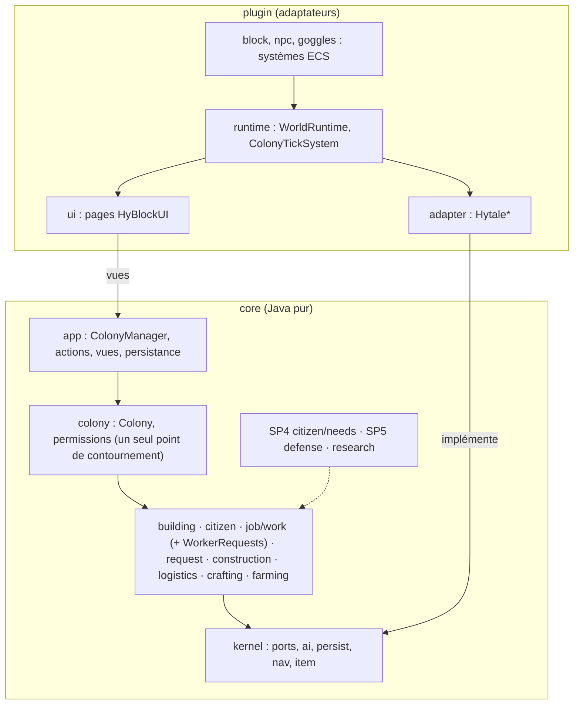

89 constats — 0 critique, 2 hauts, 7 moyens, 80 bas | 43 vérifiés : 9 confirmés (≥ MOYEN) / 21 déclassés / 4 déjà connus / 7 avertissements / 2 abandonnés | Update 7 : 0 symbole à migrer, 2 points restants | commit 3e2e70ca (code identique à c24bf475)

# Audit global HyColony (2026-09-29)

Audit en lecture seule de HyColony, HyDomum, HyVanilla et HyBlockUI sur Hytale 0.7.0-pre.4, contre `CLAUDE.md` et MineColonies `version/main`. Méthode : phase 0 (inventaire et métriques, `00-inventaire.md`), phase 1 (carte, `01-architecture.md`, cinq explorations dont deux dans les sources décompilées du serveur), phase 2 (treize axes A à M, `02-findings-*.md`, six relecteurs de périmètre et six contrôles de fidélité MineColonies), phase 3 (complétude, `02-findings-completude.md`), phase 4 (contre-vérification biaisée vers la réfutation de chaque constat MOYEN ou plus par quatre vérificateurs neufs, `03-verification.md`). Les sévérités de ce rapport sont celles **après vérification** ; les fichiers `02-findings-*` gardent celles d'avant. Pendant l'audit, une autre session a déplacé la couche applicative du cœur vers `app` (docs, commit c24bf475) puis a commencé un système de loisir (`citizen/*`, non commité) : les lignes citées valent pour `git show 3e2e70ca:<chemin>`.

## 2. Résumé exécutif

**Verdict : Prêt à étendre, après le palier 1** (deux bugs HAUT et sept MOYEN, tous à effort S ou M). Score global pondéré : **76/100**.

Risques majeurs :
1. Un chantier dont une partie est dans un chunk non chargé est « terminé » avec des trous, niveau monté (M-1, `StructureScan.java:53-55`, `BuilderBlockWork.java:198-207`).
2. Le fermier ne redemande jamais graines ni engrais après la première livraison : sa requête de hutte n'est jamais `RECEIVED` (E-2, `FarmWork.java:220-229`).
3. Sept règles de jeu s'écartent de MineColonies sans le marqueur `Deviation from MC:` que le § 6 exige, dont trois décidées par les specs SP0/SP1-2 sous une « fidélité » inexacte (réessais 11× plus rapides, distance de fondation, errance) et une qui contredit la spec (contournement opérateur/créatif absent des huttes, M-2).

Forces majeures :
1. Les frontières sont vérifiées par le build (ArchUnit avec matrice figée, `checkModApis`, `checkFileSizes`, PMD à liste décroissante, NullAway en erreur) et **aucune** classe géante de MC n'a été copiée : `Colony` 233 l. (MC ~2 000), `CitizenData` ~130 l. (MC ~2 200), une seule classe abstraite, IA composée sur `WorkerMachine`.
2. Fidélité des formules, cadences et machines à états : six systèmes comparés ligne à ligne, 249 fichiers citant leur source MC, 169 écarts documentés tous jugés cohérents ; le port corrige même des bugs de MC (`CraftingBatches`).
3. Robustesse et tests : ports gardés (`GuardedBodies`, « première WARNING puis FINE »), attentes bornées (`StuckHandler`), sauvegarde versionnée avec migrations, fixtures, `.tmp` → `.bak` → move atomique, contenu inconnu gardé brut ; 1 224 tests, 59 des 60 derniers `fix(core)` avec leur test.

## 3. Scorecard

Score = Σ(poids × note/5 × 100) = 76.

| Axe | Poids | Note /5 | Chiffres clés mesurés | Une phrase |
|---|---|---|---|---|
| A Structure, SOLID/GRASP | 10 % | 4 | 16 ports/16 adaptateurs/16 fakes ; 1 classe abstraite ; 0 `getInstance` ; 8 constats (4 MOYEN → BAS après vérification) | Ports et adaptateurs tenus, composition partout ; il reste des classes d'action à alléger et deux règles de jeu dans les plugins. |
| B Classes fourre-tout | 10 % | 4 | max 366 l. ; listes de taille vides ; 16 exceptions PMD (plugin) | Aucune pile de protocoles copiée de MC ; les dettes PMD du plugin sont connues et leurs découpages tiennent. |
| C Couplage, cycles | 10 % | 4 | 578 arêtes, 0 arête morte dans la matrice ; cycles de sous-paquets non gardés : 4 | Le cycle par `Colony` est l'agrégat MC, figé par décision ; étendre `beFreeOfCycles`. |
| D État statique, cycle de vie | 5 % | 4 | 2 statiques non finaux, 3 conteneurs statiques, 2 enregistrements hors proxies | Tout l'état est par monde ; seul le rechargement de plugin (non supporté) casse. |
| E Threads, robustesse | 10 % | 3 | 19 systèmes, 14 gardés ; 1 bug HAUT (fermier), 1 MOYEN (2 systèmes sans garde) ; E-1, E-4, E-6 réfutés dans le décompilé | Tout sur le thread du monde, sorties documentées ; un état de fermier sans sortie. |
| F Hygiène ECS | 5 % | 5 | 2 composants, 0 `isParallel`, `Ref` toujours vérifiées | Surface ECS minuscule et propre. |
| G Idiomes Java 25 | 5 % | 4 | 212 records, 13 `sealed`, 0 preview, 16 avertissements Error Prone tolérés | Moderne et épinglé ; `Optional` en champ et `null` renvoyés hors ports à nettoyer. |
| H Données, textes, config | 5 % | 4 | 5 `.lang` à parité exacte, 0 imbrication sur `.Text`, 0 nom JSON U7 périmé ; 1 MOYEN (id brut dans le chat) | Contenu en données comme MC ; quelques replis anglais. |
| I Persistance | 10 % | 4 | schéma 5, 4 migrations, 8 fixtures ; 3 lecteurs stricts (1 MOYEN) | Socle solide ; trois lecteurs n'utilisent pas `SavedJson`. |
| J UI, validation | 5 % | 4 | 100 % des boutons → action du cœur avec permission ; 10 records de vue | Le joueur ne voit que des vues ; rafraîchissement partiel. |
| K Performance par tick | 5 % | 4 | ≈ 300-400 appels, 30-60 allocations/tick pour 20 citoyens (estimé) ; bornes `SCAN_LIMIT`, `SEARCH_LIMIT` | Machines sans allocation, cadences décalées ; pics ponctuels connus. |
| L Tests, outillage | 5 % | 4 | 1 224 tests, 59/60 fix testés, CI, PMD baseline forcée à rétrécir | TDD réel ; quelques reprises après rechargement non testées. |
| M Fidélité MineColonies | 15 % | 3 | 6 systèmes comparés, 249 citations, 169 écarts documentés ; 1 HAUT, 4 MOYEN, 7 avertissements, 22 BAS | Formules et cadences fidèles ; règles de fondation, permission et requêtes s'écartent sans le dire. |

## 4. À conserver tel quel

- **Les garde-fous du build** : `build-logic/src/main/kotlin/hy.java-checks.gradle.kts` (`checkFileSizes` 400/15, `checkSectionDividers`, `checkModApis`, `checkPmdBaseline` qui force la liste à rétrécir, `checkPmdRulesetLoads`, NullAway en erreur), `core/src/test/java/dev/hycolony/core/FeatureDependenciesTest.java:20-73` (matrice figée, `ensureAllClassesAreContainedInArchitecture`), `ArchitectureTest.java`, `.githooks/`, `guard.js`.
- **L'agrégat `Colony` et son cycle** avec les fonctionnalités (`FeatureDependenciesTest.java:14-18`) : c'est `IColony` de MC, décidé par écrit ; on fige, on ne casse pas.
- **Ports → `Hytale*` → `Fake*`** (`01-architecture.md` § 2.5) et la racine de composition `WorldRuntime.java:61-105` : tout l'état par monde, construit sur le thread du monde.
- **`ColonyTickSystem.java:14-44`** : cœur découplé du TPS serveur, rattrapage borné à 10 pas ; et `HytaleCitizenBodies.spawn` synchrone depuis le tick (légal : `Store.tickInternal` ne tient pas `processing`, `Store.java:1990-2013`), les autres mutations différées par `world.execute`.
- **`kernel/ai/TickRateStateMachine.java` + `TickingTransition.java:29-30`** (port ligne à ligne de MC, décalage `OFFSET_VARIANT`) et **`job/work/*`** (`WorkerMachine`, `WorkerStock`, `SyncRequests`, `ToolRequests`, `WorkerHands`, `WorkDelay`) : le socle de `AbstractEntityAIBasic` en collaborateurs composés.
- **`request/`** : `RequestManager` façade + `RequestAssigner`/`RequestTransitions`/`RequestCanceller`, `Requestable` scellé avec `switch` exhaustifs (audit B § 1.3 : « ne pas passer à un registre »), `SavedRequests.java:35-59` (réparation des familles).
- **Persistance** : `ColonyPersistence.java:75-104`, `FileColonyStorage.java:99-150`, `MigrationChain` + fixtures, contenu inconnu gardé brut (`ColonySerializer.java:141-145`, `BuildingSerializer.java:88-89`, `CitizenSerializer.java:91-101`), `SavedJson`.
- **`GuardedBodies.java:94-115`**, **`StuckHandler.java:380-426`**, **`OpenWindows.java:55-62`** (une fenêtre qui échoue est retirée), **`BlockUse.java:37-42`** (ordre MC des vérifications, écarts documentés).
- **`WorldRuntimes.remove`** (`:48-63`) : miroir exact de `Universe.removeWorld` (vérifié, E-4 abandonné) ; ajouter seulement un commentaire citant `Universe.removeWorld:1314`.
- **Le contenu en données** : `id-map.json` validé au démarrage (`WorldRuntimes.enableIfIdsValid`), `crafting.json`, `config.json` par sections MC avec bornes identiques à `ServerConfiguration`, packs de styles en sous-plugins, générateurs `tools/` sur la version épinglée.
- **Les 7 décisions écrites signalées en AVERTISSEMENT** ne sont pas à annuler : elles demandent un marqueur `Deviation from MC:` et, pour trois d'entre elles, une correction de la spec qui les présente comme fidèles.

## 5. Tableau des constats (top 25)

Tri : sévérité finale puis effort. `Vérif.` = décision de la phase 4 (— : constat BAS non soumis à vérification).

| # | Sév. | Axe | Titre | `fichier:ligne` | Conf. | Effort | Vérif. |
|---|---|---|---|---|---|---|---|
| M-1 | HAUT | M | Chantier « terminé » dans un chunk non chargé | `core/.../construction/builder/StructureScan.java:53-55` ; `BuilderBlockWork.java:198-207` | HAUTE | S | CONFIRMÉ |
| E-2 | HAUT | E | Le fermier ne redemande jamais graines ni engrais | `core/.../farming/job/FarmWork.java:220-229` | HAUTE | S/M | CONFIRMÉ |
| I-1 | MOYEN | I | `WorkerModule.read` stricte : colonie verrouillée sur une valeur inconnue | `core/.../job/WorkerModule.java:166-171` | HAUTE | S | DÉCLASSÉ (HAUT → MOYEN) |
| H-2 | MOYEN | H | `hycolony:builder` brut dans le chat « ordre créé » | `core/.../construction/workorder/WorkManager.java:92-98` | HAUTE | S | CONFIRMÉ |
| E-3 | MOYEN | E | `Visibility.tick` et `HighlightMarkers.update` sans garde : thread tué | `plugin/.../goggles/GogglesSystems.java:145-161` ; `ui/highlight/HighlightMarkers.java:24-33` | HAUTE | S | DÉCLASSÉ (HAUT → MOYEN) |
| M-4 | MOYEN | M | Parent réassigné avec la liste noire héritée (tâche `Crafting` sans sortie) | `core/.../request/RequestTransitions.java:116-119` | HAUTE | S | DÉCLASSÉ |
| M-7 | MOYEN | M | Bloc à remplacer miné avec délai, usure et XP (UPGRADE, REPAIR) | `core/.../construction/builder/BuilderBlockWork.java:49-54` | HAUTE | S | CONFIRMÉ |
| M-2 | MOYEN | M | Contournement opérateur/créatif absent de `hasPermission` (spec SP0 l. 175 promet la parité) | `core/.../colony/permission/Permissions.java:161-163` + 14 appelants | HAUTE | S/M | DÉCLASSÉ |
| M-5 | MOYEN | M | `onColonyUpdate` ne remonte pas aux parents (recette apprise) | `core/.../request/resolver/PlayerResolver.java:115-121` | HAUTE | M | DÉCLASSÉ |
| I-4 | BAS | I | Commentaire faux : les requêtes inconnues ne sont pas relues « once their pack is back » | `core/.../request/SavedRequests.java:29-30` | HAUTE | S | DÉCLASSÉ |
| E-8 | BAS | E | Commentaires faux sur `processing` (le tick est hors verrou) | `plugin/.../adapter/HytaleCitizenBodies.java:309` ; `HytalePreviewPort.java:36-37` | HAUTE | S | — |
| G-3 | BAS | G | Ordinal d'un enum Hytale persisté comme rotation ; 16 avertissements tolérés | `plugin/.../block/HutBlockSystems.java:101` | HAUTE | S | — |
| D-1 | BAS | D | Rechargement impossible : `registerCoreComponentType` lève au second `setup()` | `plugin/.../HyColonyPlugin.java:60` | HAUTE | S | DÉCLASSÉ |
| D-2 | BAS | D | Après rechargement, HyDomum sans catalogues ni variantes | `domum/plugin/.../HyDomumPlugin.java:87-94` | HAUTE | S | DÉCLASSÉ |
| M-16 | BAS | M | Vidage du bâtisseur : règle propre au lieu de `dumpKeepingHutRules` | `core/.../construction/builder/BuilderAI.java:178` ; `job/work/WorkerStock.java:156-168` | HAUTE | S | DÉCLASSÉ |
| M-15 | BAS | M | `containers()` = hutte puis étagères, MC l'inverse | `core/.../building/Building.java:161-168` | HAUTE | S | DÉCLASSÉ |
| M-14 | BAS | M | Modules tickés pour des bâtiments non chargés | `core/.../building/BuildingManager.java:93-101` | HAUTE | S | DÉCLASSÉ |
| I-2 | BAS | I | `PermissionsSerializer.read` stricte (édition manuelle) | `core/.../colony/permission/PermissionsSerializer.java:49-64` | HAUTE | S | DÉCLASSÉ |
| I-3 | BAS | I | `CourierAssignmentModule.read` stricte (fichier corrompu) | `core/.../logistics/warehouse/CourierAssignmentModule.java:97-103` | HAUTE | S | DÉCLASSÉ |
| E-7 | BAS | E | `world.execute` hors garde (déconnexion, `PlayerReady`, filet d'arrêt) | `plugin/.../HyColonyPlugin.java:98, 123-139` | HAUTE | S | — |
| K-5 | BAS | K | Boxing `Float` + map concurrente à chaque tick serveur | `plugin/.../ColonyTickSystem.java:20,33,43` | HAUTE | S | — |
| C-1 | BAS | C | Cycles de sous-paquets non gardés par ArchUnit | `core/.../farming/job` ↔ `farming/hut` ; `request` ↔ `request/resolver` | HAUTE | S | — |
| H-3 | BAS | H | Textes anglais ou bruts (nom par défaut, étapes du cutter, `Message.raw` sur `.Text`) | `core/.../app/ColonyFoundation.java:58` ; `domum/plugin/.../cutter/CutterOpener.java:30` | HAUTE | S | — |
| G-1 | BAS | G | `Optional` en champ et en paramètre | `core/.../farming/field/FarmField.java:19-20, 37, 50` (+11) | HAUTE | S | — |
| B-1 | BAS | B | Dettes PMD du plugin : découpages toujours valables, non faits | `config/pmd/known-violations.txt` (16 lignes) | HAUTE | M | DÉJÀ CONNU |

Les 64 autres constats (tous BAS) sont dans `02-findings-A` à `M`, avec leur tableau compact ; M-11 à M-32 dans `02-findings-M.md` § 2.

### Fiche M-1 — HAUT — Chantier « terminé » dans un chunk non chargé
`core/src/main/java/dev/hycolony/core/construction/builder/StructureScan.java:53-55` ; `BuilderBlockWork.java:198-207` ; `BuilderAI.java:116-122, 212-223`
```java
BlockState world = blocks.get(pos).orElse(null);
return switch (stage) {
    case CLEAR -> world != null && clears(site, pos, world) && notAHut(pos);
```
Mécanisme : aucun `WorldBlocks.isLoaded` dans `construction/`. Une position dont la section n'est pas chargée « n'a pas besoin de travail » en CLEAR ; en SOLID/DECORATE `satisfied(e, null)` est faux, la marche est « terminée » par l'anti-blocage, `place` renvoie `false` (`HytaleWorldBlocks.java:120-122, 152-165`) et l'index avance avec un WARNING ; `orderLost` ne regarde que l'ordre. MC `AbstractEntityAIStructureWithWorkOrder.checkIfCanceled` (:479-496) renvoie l'IA en IDLE tant que `!WorldUtil.isBlockLoaded(world, wo.getLocation())`, et Minecraft charge les chunks en synchrone à l'accès, ce que Hytale n'a pas.
Impact : corps chargé en bordure de zone chargée, positions du plan dans le chunk voisin : CLEAR sauté en silence, SOLID/DECORATE sautés, `COMPLETE_BUILD` : niveau monté, claims, XP, message « terminé », bâtiment troué ; la vérification finale ne repasse que SOLID/DECORATE.
Remède : dans `structureStep`/`work`, `return null` (attendre) quand `!ctx.blocks().isLoaded(pos)`, ou porter `checkIfCanceled` sur la position du bâtiment en STATE_BLOCKING ; test d'abord avec `FakeWorldBlocks` déchargé sur une moitié du plan.
Équivalent MC : `checkIfCanceled`, `AbstractEntityAIStructure.java:158`.

### Fiche E-2 — HAUT — Le fermier ne redemande jamais graines ni engrais
`core/src/main/java/dev/hycolony/core/farming/job/FarmWork.java:220-229` ; `building/Building.java:197-200` ; `job/work/SyncRequests.java:59,105` ; `construction/builder/BuilderRequests.java:80-85`
```java
if (r.requestable() instanceof StackRequest s && s.item().equals(item) && r.state().isBefore(RequestState.RECEIVED)) { return; }
...
ctx.colony().requests().createAndAssign(ctx.hut(), new StackRequest(item, count, 1, true), Request.NO_CITIZEN);
```
Mécanisme : la requête est déposée au nom de la hutte (`NO_CITIZEN`) ; une fois `COMPLETED` (ordinal 7, `isBefore(RECEIVED)` = 10), personne ne la passe `RECEIVED` : `Building.onRequestComplete` ne reçoit que les requêtes non livrables, `SyncRequests.pickUp` celles portant l'id du citoyen, `BuilderRequests.receiveCompletedBuildingRequests` n'est appelé que par le bâtisseur (trois seuls émetteurs de `RECEIVED`, grep). « Fournir » → `overrule` → `COMPLETED` sans parent, la requête reste dans `byRequester(hut)` et `askOnce` sort.
Impact : 64 graines plantées en une passe (un champ de rayon 5 fait 121 cases) ; à la passe suivante, hutte vide, `askOnce` muet, `nextStage()` saute la plantation, définitivement ; idem l'engrais une fois usé. Les tests (`FarmWorkPrepareTest` l. 40, 100) ne complètent jamais la requête.
Remède : recevoir les requêtes de hutte `COMPLETED` quand le fermier est à la hutte (déplacer `receiveCompletedBuildingRequests` dans `job/work` et l'appeler dans `prepare()`), compatible avec la spec farmer § 12 ; test d'abord `hutAsksForSeedsAgainOnceTheDeliveredOnesAreUsedUp`.
Équivalent MC : `lookForRequests`/`markRequestAsAccepted` en NEEDS_ITEM (`AbstractEntityAIBasic.java:606-636`).

## 6. Quick wins (≤ 1 h, impact ≥ MOYEN, par rapport impact/effort)

1. **I-1** : `SavedJson.enumOf(HiringMode.class, …).orElse(DEFAULT)` et `workers` lu élément par élément dans `WorkerModule.read` ; même motif dans `CourierAssignmentModule.read` (I-3) et `PermissionsSerializer.read` (I-2). Test : `unknownHiringModeFallsBackToDefault`.
2. **E-3** : `try { … } catch (RuntimeException e) { LOG SEVERE }` dans `GogglesSystems.Visibility.tick` et `HighlightMarkers.update`.
3. **M-4** : `assigner.reassign(parent, Set.of())` dans `RequestTransitions.java:119` ; test `craftingParentFallsBackToThePlayerWhenItsDeliveryFails`.
4. **H-2** : le paramètre `%hycolony.ui.building.type.<id>` de `BuildCompletion` dans `WorkManager.announceCreated` ; test sur `FakeNotifier`.
5. **M-7** : `mustMineFirst` après `lacking(cost)` et retrait sans délai (drops gardés, minerais compris) ; test « UPGRADE ne mine pas le bloc remplacé ».
6. **Marqueurs § 6** : un `Deviation from MC:` sur les sept avertissements (M-3 `RetryingResolver`, M-6 `TerritoryIndex.isFreeForNewColony`, M-8 `CitizenAI` errance, M-9 les deux `onException`, M-10 `updateBodyIfNecessary`, M-12 `ColonyState`, H-1 déjà en Javadoc) et la ligne de spec qui manque ; pour M-3, décider 3 min (marqueur) ou 33 min (alignement : `- 1` par appel).
7. **I-4 + E-8** : corriger le commentaire de `SavedRequests.java:29-30`, ceux de `HytaleCitizenBodies.java:309` et `HytalePreviewPort.java:36-37`, et citer `Universe.removeWorld:1314` dans `WorldRuntimes.remove`.
8. **G-3** : la valeur déclarée de `Rotation` (un `switch` de 4 cas) dans `HutBlockSystems.java:101` au lieu de l'ordinal.
9. **D-1/D-2** : attraper l'`IllegalArgumentException` de `registerCoreComponentType` avec un log « reload not supported », et amender la spec sous-plugins l. 57 (ou `ornaments.start` direct si les assets sont déjà chargés).
10. **M-16 + M-15** : `dumpKeepingHutRules(true)` dans `BuilderAI.dumpInventory` (supprime `toolsAnd`) et étagères avant hutte dans `Building.containers()` (une ligne chacun, tests existants verts, spec SP3a l. 73 à ajuster).

## 7. Plan de refactoring ordonné

Chaque étape suit `CLAUDE.md` § 9 : petite modification (§ 9.2, conception courte validée dans la conversation) ou nouveau système (§ 9.1, spec puis plan) ; test d'abord ; `./gradlew build` vert ; relecture `hycolony-reviewer`, plus `mc-fidelity-checker` quand un système MC est touché ; test en jeu ajouté à `docs/TESTING.md` ; aucune ligne ajoutée aux listes d'exceptions. `ACCORD REQUIS` = garde-fou (§ 10).

### Palier 1 : stabilité

| # | Objectif | Constats | Prérequis | Fichiers | Test d'abord, vérification | Relecture | Test en jeu | Risque | Effort |
|---|---|---|---|---|---|---|---|---|---|
| 1 | Le bâtisseur attend qu'une position soit chargée | M-1 | — | `construction/builder/BuilderAI.java`, `StructureScan.java`, `BuilderBlockWork.java` | `builderWaitsWhileAPlanPositionIsUnloaded` (FakeWorldBlocks partiel) ; `:core:test` ; `ConstructionSimulationTest` | reviewer + fidelity | chantier à cheval sur la limite de chargement : aucun bloc sauté, pas de « terminé » | faible (une garde) | S |
| 2 | Le fermier reçoit ses requêtes de hutte | E-2 (+ B-2 : `WorkerRequests` partagé) | — | `job/work/` (nouveau `WorkerRequests` ou déplacement de `receiveCompletedBuildingRequests`), `farming/job/FarmWork.java`, `construction/builder/BuilderRequests.java` | `hutAsksForSeedsAgainOnceTheDeliveredOnesAreUsedUp` ; `FarmWorkPrepareTest` | reviewer + fidelity | 2 passes de champ avec 64 graines : seconde demande visible | moyen (bâtisseur partagé) | S/M |
| 3 | Lectures tolérantes des trois lecteurs stricts | I-1, I-2, I-3 | — | `job/WorkerModule.java`, `colony/permission/PermissionsSerializer.java`, `logistics/warehouse/CourierAssignmentModule.java` | 3 tests dans `MissingKeysLoadTest`/`WorkerModuleTest` ; fixture éditée | reviewer | sauvegarde éditée (`hiringMode: "X"`) : colonie chargée | faible | S |
| 4 | Gardes des deux systèmes chauds et des `execute` | E-3, E-7, E-10 | — | `plugin/goggles/GogglesSystems.java`, `ui/highlight/HighlightMarkers.java`, `HyColonyPlugin.java`, `npc/CitizenFireImmunitySystems.java` | compilation (plugin) ; grep « catch (RuntimeException » = 100 % des systèmes | reviewer | lunettes + surbrillance de champ + déconnexion pendant `/world remove` | faible | S |
| 5 | Requêtes : liste noire vide à la réassignation du parent ; remontée aux parents | M-4, M-5 | — | `request/RequestTransitions.java`, `request/resolver/PlayerResolver.java`, `RetryingResolver.java` | `craftingParentFallsBackToThePlayerWhenItsDeliveryFails`, `learningARecipeReclaimsAnIngredientTreeHeldByThePlayer` ; `ResolversTest` | reviewer + fidelity | planches demandées, bûches chez le joueur, apprendre la recette : la requête quitte le presse-papiers | moyen (assigneur) | S + M |
| 6 | Textes : nom traduit dans « ordre créé », nom de colonie par défaut, étapes du cutter | H-2, H-3 | — | `construction/workorder/WorkManager.java`, `app/ColonyFoundation.java`, `domum/plugin/.../cutter/*`, 4 `.lang` (en-US, fr-FR) | test sur `FakeNotifier` ; parité des clés (cmd 19) | reviewer | chat après « Construire » : « Hutte du constructeur », pas `hycolony:builder` | faible | S |
| 7 | Restes d'Update 7 | L-4 | — | `plugin/.../adapter/HytaleWorldQuery.java` (`isLoaded` par section), `docs/research/update-7/README.md` (entrée `tools/decorations`) | grep `getChunkReference(ChunkUtil.indexChunkFromBlock` = 0 | reviewer | selftest `[OK]` | faible | S |

### Palier 2 : structure et fidélité

| # | Objectif | Constats | Prérequis | Fichiers | Test d'abord, vérification | Relecture | Test en jeu | Risque | Effort |
|---|---|---|---|---|---|---|---|---|---|
| 8 | Un seul point de contournement opérateur/créatif | M-2 | 3 | `colony/permission/Permissions.java` (prédicat injecté) ou `app/ColonyProtection.isAllowed` pour les 14 appelants | `creativeOperatorManagesAForeignHut` ; `PermissionsTest` | reviewer + fidelity | opérateur créatif ouvre et gère une hutte étrangère (`TESTING.md` 55 étendu) | moyen (14 sites) | S/M |
| 9 | Fidélité du bâtisseur et de l'entrepôt : remplacement sans délai, vidage par les règles de la hutte, étagères d'abord, tick des seuls bâtiments chargés, disque de revendication | M-7, M-16, M-15, M-14, M-11 | 1 | `construction/builder/BuilderBlockWork.java`, `BuilderAI.java`, `job/work/WorkerStock.java` (suppr. `toolsAnd`), `building/Building.java`, `building/BuildingManager.java`, `colony/territory/TerritoryIndex.java` | un test par point ; `ClaimRadiusTest`, `WarehouseCourierSimulationTest` | reviewer + fidelity | amélioration niveau 1→2 : pas de délai de minage sur les blocs remplacés ; entrepôt neuf : première pile sur une étagère | moyen | S ×5 |
| 10 | Marquer et documenter les sept décisions (`Deviation from MC:` + spec) ; trancher M-3 | M-3, M-6, M-8, M-9, M-10, M-12, H-1 | — | `request/resolver/RetryingResolver.java`, `colony/territory/TerritoryIndex.java`, `citizen/CitizenAI.java`, `job/work/WorkerMachine.java`, `citizen/CitizenManager.java`, `colony/ColonyState.java`, specs SP0 § 3.2/3.4, SP1-2 § « Requêtes » | `docs/research/minecolonies-analysis.md:78` mis en cohérence ; si M-3 aligné : `ResolversTest` et `TESTING.md` 29 (33 min) | fidelity | si aligné : annonce au joueur après ~33 min | faible (doc) / moyen (M-3 aligné) | S |
| 11 | Découper les quatre classes PMD du plugin, retirer leurs lignes | B-1 | — | `plugin/.../adapter/HytaleItemCatalog.java` (`HytaleBlockInfo`/`HytaleToolStats`), `HytaleCitizenBodies.java` (références/navigation/gestes), `command/HyColonyCommand.java` (`ConstructionSelfTest`, une classe par sous-commande), `adapter/HytaleUiPort.java` (`FoundColonyWindow`, `PageOpener`) ; `config/pmd/known-violations.txt` (−13 lignes) | `pmdMain` vert sans les lignes ; selftest | reviewer | `/hycolony selftest` tout `[OK]`, fenêtres inchangées | moyen (adaptateurs) | M ×4 |
| 12 | Fuites et cycles : purge de `Highlights`, `accumulators`, `DetouringBodies.forget` au déchargement ; `beFreeOfCycles` sur `logistics`, `farming`, `request` | D-3, C-1 | — | `plugin/.../ui/highlight/Highlights.java`, `WorldRuntimes.java`, `core/.../kernel/nav/DetouringBodies.java`, `citizen/CitizenManager.java`, `ArchitectureTest.java` | `unloadedBodyLosesItsAiAndReloadingItRebindsWithoutASecondBody` ; ArchUnit vert | reviewer | citoyens rechargés après éloignement : un seul corps | faible | S |
| 13 | Règles du cutter dans `domum/core` (reporté par décision tant que l'autre session travaille sur HyDomum) | A-4, L-2 | décision utilisateur | `domum/core/.../cutter/CutterCraftPlan` (nouveau), `domum/plugin/.../cutter/CutterCrafting.java`, `CutterCraftClicks.java`, `CutterSlots.java` | tests du plan (tout-ou-rien, plafond, `MAX_BATCH`) | reviewer | établi : échec au milieu d'un lot, rien consommé | moyen | M |
| 14 | Actions : `HutPlacementRules`, `WorkOrderRules`, `WandViews`, `Colony.broadcast` | A-1, A-2, A-5 | — | `app/action/HutActions.java`, `construction/workorder/WorkManager.java`, `app/wand/WandActions.java`, `colony/Colony.java` | tests existants verts ; PMD | reviewer | aucun (refactor) | faible | S ×3 |

### Palier 3 : idiomes et outillage

| # | Objectif | Constats | Prérequis | Fichiers | Test d'abord, vérification | Relecture | Test en jeu | Risque | Effort |
|---|---|---|---|---|---|---|---|---|---|
| 15 | `Optional` en retour seulement ; `null` hors ports en `Optional` | G-1, G-2 | fin du loisir (autre session) | `farming/field/FarmField.java`, `FieldWalk.java`, `farming/job/FarmWork.java`, `citizen/CitizenData.java`, `Skill.java` + appelants | tests existants ; NullAway | reviewer | aucun | faible | M |
| 16 | Traiter les 16 avertissements puis Error Prone en erreur et `-Xlint:deprecation` | G-3, L-3 | 8 (G-3) | 15 fichiers du plugin + `build-logic/.../hy.java-checks.gradle.kts` (**ACCORD REQUIS**) | `compileJava --rerun` = 0 avertissement | reviewer | aucun | faible | S |
| 17 | Pics par tick : autosave étalée, accumulateur dans `WorldRuntime`, `isAlive` hors de `tickAi`, historique de machine | K-1, K-4, K-5, K-6 | — | `plugin/.../WorldRuntime.java`, `ColonyTickSystem.java`, `core/.../app/ColonyPersistence.java`, `citizen/CitizenManager.java`, `kernel/ai/TickRateStateMachine.java` | `PersistenceTest` (une colonie par tick), `TickRateStateMachineTest` | reviewer | 5 colonies : pas de saccade à l'autosave | faible | S |
| 18 | Fixture v5, une seule constante de schéma, `heal` complet | I-8, I-9 | — | `core/src/test/resources/fixtures/colony-v5.json`, `kernel/persist/MigrationChain.java`, `app/persistence/ColonySerializer.java` | `MigrationV4ToV5Test` étendu | reviewer | aucun | faible | S |
| 19 | Tests de reprise (DECORATE, REMOVE, DONE, plan MC) et de déchargement ; passe finale persistée | L-1, I-6 | 1 | `BuilderCleanupTest`, `construction/workorder/WorkOrder.java` (`finalCheck`) | 5 tests sur `restart()` | reviewer | redémarrage pendant la décoration : reprise sans repose | faible | S |
| 20 | Documentation : sources MC des constantes, Javadoc « 0.6.8 », spec SP0/SP1-2 (fidélité annoncée à tort, l. 299 périmée), `manifest` `Website` | M-32, L-4, M-12, M-6 | — | `colony/Colony.java`, `citizen/CitizenManager.java`, `CitizenAI.java`, `VariantAssets.java`, `InventoryGrids.java`, specs | grep `\bMC [A-Z]` sur les constantes | — | aucun | nul | S |

## 8. Architecture cible

L'architecture ports et adaptateurs découpée par fonctionnalité est une décision validée (§ 1) et le code la respecte : la cible la **raffine**. Rien ne justifie une couche de plus.

- **Matrice `FeatureDependenciesTest`** : aucune arête morte, rien à retirer aujourd'hui ; garder la règle « elle ne peut que rétrécir ». Ajouter `slices().beFreeOfCycles()` à `logistics`, `farming`, `request` (C-1) après avoir cassé `farming/job ↔ farming/hut` et `request ↔ request/resolver` ; documenter `app ↔ app.action` et `building ↔ building.module` comme intrinsèques.
- **Un point de permission** : `Permissions.hasPermission` reçoit le prédicat « opérateur créatif » (ou tous les appelants passent par `ColonyProtection.isAllowed`), pour que les huttes, les blocs et les futurs événements d'entité (SP4/SP5 : `TOSS_ITEM`, `ATTACK_CITIZEN`…) partagent la règle MC.
- **`job/work/WorkerRequests`** : le pas `needsItem`/`waitForRequests`/réception à la hutte, aujourd'hui dans `BuilderGathering` et `CraftingWork`, extrait pour le bâtisseur, l'artisan et le fermier (E-2, B-2). C'est le dernier morceau de `AbstractEntityAIBasic` non partagé.
- **`construction/builder`** (15 fichiers) : décider `builder/site` (`BuildSite`, `StructureScan`, `StructureLoader`, `WorkSpot`) avant le prochain fichier ; `kernel/port`, `request`, `plugin/adapter` sont aussi à 15.
- **Plugin** : un paquet `runtime` (`WorldRuntime`, `WorldRuntimes`, `RuntimeSetup`, `ColonyTickSystem`) importé par tous et n'important que des interfaces, pour casser les 8 cycles avec la racine (C-2) ; les quatre découpages PMD (B-1).
- **Place des futurs systèmes** : SP4 (bonheur, nourriture, maladie, logement, mort) en sous-paquets de `citizen/` (`citizen/needs`, `citizen/home`) branchés par `TickingModule` et `CitizenAI` (la priorité manger/malade/nuit rejoint la pluie dans `calculateNextState`) ; SP5 (gardes, raids) en fonctionnalité `defense/` sur le socle `job/work`, avec un `RaidManager` possédé par `Colony` ; recherche en `research/` avec définitions en JSON du pack (comme `crafting.json`) et progression par colonie dans `ColonyRegistries` ; quêtes idem. Aucune de ces fonctionnalités ne doit toucher `CitizenSerializer`, `ColonySerializer` ni `Job` autrement que par module et registre (c'est déjà vrai).
- **Correspondance MC → Hytale** (inchangée) : `Colony` = agrégat Java par monde, pas une entité ECS ; `CitizenData` ↔ `CitizenTag` (composant persisté, id seulement) ; vues = records du cœur rendus par HyBlockUI ; pas de paquets réseau.



## 9. Checklist de complétude MineColonies

Tableau complet dans `02-findings-completude.md`. Résumé : 9 domaines PRÉSENT (colonie, bâtiments et modules, métiers et IA, requêtes et logistique, ordres et bâtisseur, permissions, événements, sauvegarde, UI), 1 traduit pour Hytale (synchronisation → vues rafraîchies toutes les 20 ticks), 1 PARTIEL (citoyens : handlers SP4 à venir), 6 PLANIFIÉ (recherche, bonheur, raids et gardes, quêtes, secondaires, rattrapage hors ligne). Aucun DIVERGENT structurel ; **vérifié** : aucune des classes géantes de MC ni son héritage d'IA n'a été copié. Les invariants manquants qui ne sont pas des reports de sous-projet sont les constats de l'axe M.

## 10. Compatibilité 0.7.0-pre.4

Le build est vert avec Error Prone : aucun symbole supprimé ou `@RestrictedApi` n'est appelé dans le Java compilé (phase 0, cmd 17 ; `docs/research/update-7/README.md` bloquants 1-5 faits).

| Symbole ou point | Occurrences | Fichiers | Remplacement / état | Effort |
|---|---|---|---|---|
| Symboles SUPPRIMÉS / `@RestrictedApi` (liste du prompt) | 0 | — | rien à migrer | — |
| Bornes 319/320, `ValidateBlockEvent`, `readSegments`, `TickProcedure` | 0 | — | non utilisés | — |
| `SoundUtil.playSoundEvent3d/2dToPlayer` | 3 | `HytaleWorldEffects.java:141,161`, `UiSounds.java:29` | sans modificateur > 1.0 : non concerné | — |
| Noms JSON renommés (`DurationMs`, `SmallerThan`, `IsMajor`, `CursedItems`…) | 0 | 4 packs, `tools/` | rien | — |
| `Player.getPlayerRef()` `@Deprecated(forRemoval = true)` | 1 | `HighlightMarkers.java:24` | seul accès du fournisseur de marqueurs : à surveiller à la prochaine version | S |
| « À migrer » U7 : `HytaleItemCatalog.toolType` (Metals/GoblinMetal) | fait | `:262-263` (Metals exclu avec commentaire) | FAIT | — |
| « À migrer » U7 : `BenchTiers.set` → `notifyTierUpgraded` | fait | `BenchTiers.java:55` | FAIT | — |
| « À migrer » U7 : `FarmBlocks.java:96` `markNeedsSaving` | fait | `:97-99` | FAIT | — |
| « À migrer » U7 : `HytaleWorldQuery.isLoaded` par section | reste | `HytaleWorldQuery.java:37-39` (teste la colonne) | `getChunkSectionReferenceAtBlock` ; ne compte qu'en monde cubique | S |
| « À migrer » U7 : `tools/decorations/generate.py:21`, `tools/domum/tags.py:18` | reste (doc) | le dossier `tools/decorations` n'existe plus ; `tools/vanilla/pack.py:26` et `validation.py:51` lisent la version épinglée | retirer l'entrée du README | S |
| « À migrer » U7 : `sp4-sleep-home.md:189`, Javadoc `InventoryDrop` 0.6.8 | fait | — | FAIT | — |
| Mentions « 0.6.8 » restantes | 2 code, ~20 docs datées | `VariantAssets.java:31`, `InventoryGrids.java:12`, `tools/domum/families.py`, `tags.py` (commentaires) | Javadoc à actualiser ; les recherches datées restent | S |
| Opportunités U7 non auditées (`HiddenUIComponents`, `SHEARS`, `ShrinkTextToFit`, textures HyBlockUI devenues vanilla) | — | `docs/research/update-7/README.md` « Opportunités » | à planifier, hors périmètre | — |

## 11. Annexes

- **Inventaire brut** : `00-inventaire.md` (build, métriques, hits des commandes, dettes) ; carte : `01-architecture.md`.
- **Journal de vérification** : `03-verification.md` (43 constats, 4 rapports, décisions et lignes lues).
- **Constats non retenus** (détail par axe dans chaque `02-findings-*` § 2) : `RequestManager` CBO 25 (façade, audit B) ; `WorldRuntime` 41 imports (racine) ; `ColonyContext` (record, pas un service locator) ; `Building.module(Class)` premier module et 36 appels de `context()` (audit A) ; ports « sans try/catch » vérifiés non levants (`isDaytime`, `send`, `isLoaded`, `isOnline`, `insert`, `show/hide`, `defaultFillBlock`, catalogues) ; `WorldRuntimes.remove` (miroir de Hytale) ; `ShutdownEvent` (mondes déjà arrêtés) ; `windows.tick()` (gardé par fenêtre) ; `HytaleGameClock` 0.25/0.75 (échelle Hytale) ; `RetryingResolver` constantes (MC aussi) ; `BLOCK_MINING_DELAY` (option MC supprimée) ; `MaxCitizenPerColony` non lu (décision SP0, ne peut pas mordre) ; `Colony.tick` en INACTIVE (fidèle) ; `/hycolony info` sans rang (MC idem) ; baguette sans permission avant `confirm` (MC idem) ; `PasteQueue` sans contrôle par bloc (créatif, documenté) ; `cancelAt` sans joueur (bloc non revendiqué) ; deux mécanismes de permission (répartition MC) ; lunettes sans rang (MC idem) ; `Optional` de `IStateSupplier` et `return null` des suppliers (contrat MC documenté) ; `SavedVariants` sans `MigrationChain` (sens des dépendances) ; `OrnamentVariantRegistry` futurs (tous complétés en erreur) ; `VariantBuilder` AWT (commenté) ; couverture par paquet inégale (tests de simulation) ; Checkstyle/SpotBugs absents (rien qu'ils auraient attrapé de plus).
- **Limites de l'audit** : rien n'a été lancé en jeu (tout ce qui touche au rendu, aux animations, à la navigation Hytale et au client reste à observer ; `Message.raw` sur `.Text` non rejoué) ; les rapports d'exploration et de relecture viennent de sous-agents dont les lignes ont été recoupées par échantillon et par la phase 4 sur les constats MOYEN+ seulement ; les coûts par tick sont estimés, non mesurés ; les sources MC ont été lues sur `version/main` le 2026-09-29 ; HyDomum, HyVanilla et HyBlockUI ont eu un relecteur pour trois mods ; `tools/` (Python) n'a été audité qu'en surface ; l'arbre de travail a bougé pendant l'audit (couche `app`, loisir des citoyens) : les numéros de ligne de `citizen/*`, `BuilderWalker`, `BodyWalker`, `*Context`, `DeliveryDrop`, `DeliverymanAI` valent pour `git show 3e2e70ca:<chemin>`.

## 12. Suivi des corrections (2026-09-30)

Chaque correction a suivi CLAUDE.md § 9 : test d'abord, build vert, relecture `hycolony-reviewer` (plus `mc-fidelity-checker` pour les règles MC), corrections relues à leur tour. Les écarts MC décidés dans les specs ont été alignés sur MC (choix de l'utilisateur), specs corrigées.

| Constat | État | Commits |
|---|---|---|
| M-1 chantier non chargé | corrigé ; hauteur du monde ajoutée | `5550e199`, `6c41a26a` |
| E-2 fermier sans nouvelle requête | corrigé : `cleanAsync` de MC, règle « ni ouverte ni terminée » | `31e2732e`, `4745b423`, `493b8449` |
| I-1, I-2, I-3 lectures strictes | corrigé | `2037cf4e`, `75db5744` |
| E-3, E-7, E-10 gardes du plugin | corrigé | `7fd6d7df` |
| M-4, M-5 requêtes (liste noire, ancêtres) | corrigé ; boucle trouvée à la relecture et corrigée (`Building.stockCanServe`) | `e5dbe1f9`, `c32299f1`, `5feab345` |
| H-2 nom brut dans « ordre créé » | corrigé | `cb74824c` |
| M-7 remplacement sans minage | corrigé, étendu : bloc seulement tourné, restes de CLEAR_LEFTOVERS, blocs à entité | `f830712f`, `ebb128b3`, `334d6be5`, `49244356` |
| M-2 contournement opérateur | corrigé (`ColonyAccess`), renommage compris | `c32293b0`, `d4f35cf4` |
| I-4, E-8 commentaires faux ; `WorldRuntimes.remove` | corrigé | `eccb98e2` |
| G-3 rotation persistée par ordinal | corrigé (`getDegrees() / 90`) ; les 16 avertissements Error Prone restent | `6b5467be` (ne compile pas seul), `bcb3fc0d` |
| M-16 vidage du constructeur | corrigé ; houe gardée | `1de3de28`, `a7e930f9` |
| M-15 étagères avant la hutte | corrigé | `44c5aded` |
| M-3 retrying ×11 | aligné sur MC (1200 mises à jour) | `4005758b` |
| M-6 distance entre colonies | aligné sur MC (`ColonySpacing`, colonie la plus proche) | `f632060f`, `7981dc11` |
| M-8 errance | aligné sur MC (position courante, 100 ticks, > 10 blocs) ; branche loisir 5 % non portée, documentée | `2606e378`, `27ecdd87` |
| M-9 exception d'IA | aligné sur MC (état gardé, double délai doublé) | `2fc3f4e4`, `2d0dee77` |
| M-10 réapparition | aligné sur MC (liste de candidats, candidat suivant) | `687963e7`, `8be1987f` |
| M-12 état ACTIVE | aligné sur MC (gestionnaires) | `16ad5541` |
| Garde-fous (§ 10) | `--amend` refusé, `checkLineLength`, agents et skills instruits par `docs/research/pieges-portage.md` | `4e2a8b77`, `10252ad7`, `ec9444e1`, `88e609e9`, `f54e7c4e` |

**Reste à faire** : H-3 (textes anglais ou bruts), L-4 (`isLoaded` par section), D-1/D-2 (rechargement), M-11 (revendication en disque), M-13 (annonce joueur non documentée), M-14 (bâtiments non chargés tickés), M-17 à M-32, E-5, E-9, E-11, I-5 à I-9 (dont fixture v5), K-1, K-4, K-5, K-6 (pics par tick), C-1 et D-3 (cycles, fuites), G-1/G-2 (`Optional`), A-1, A-2, A-5 (refactors d'actions), B-1 (découpages PMD du plugin, accord requis), G-3 Error Prone en erreur (accord requis), A-4/L-2 (règles du cutter, HyDomum). Trouvé pendant les corrections : une requête que le joueur détient disparaît de sa liste si une mise à jour de la colonie la réassigne et que personne ne la reprend (MC la garde listée) ; branche loisir de `EntityAICitizenWander`.
